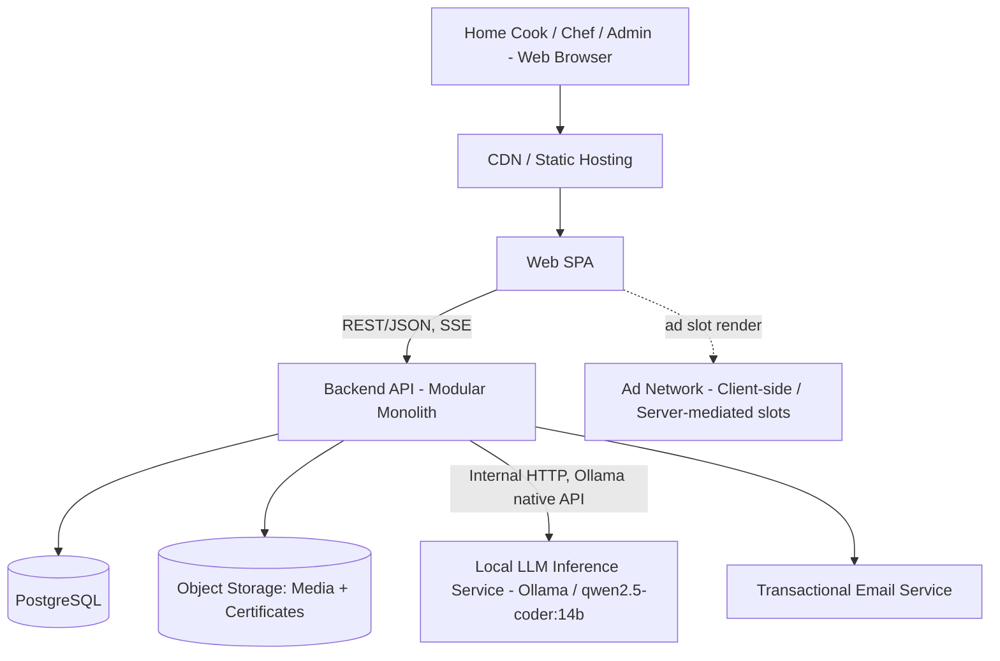
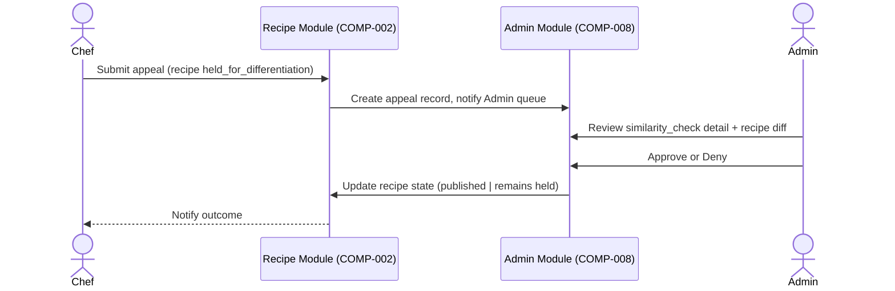
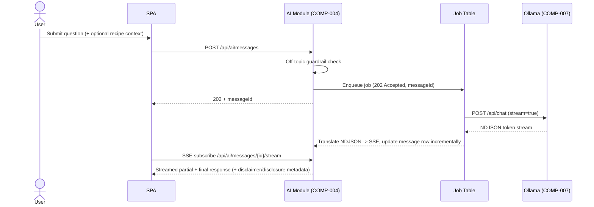

# Technical Design Document

## Document Control
- Product: Social Recipe-Sharing Platform with AI Cooking & Nutrition Assistant
- Version: 1.1
- Status: Draft — Engineering Planning Ready with Non-Blocking Open Items
- Last Updated: 2026-08-30 (revision 2 — requester-directed changes: Ollama/qwen2.5-coder:14b, confirmed FastAPI backend, local-first MVP deployment target, chef-deletion attribution model, confirmed AI-fallback UX, recommended feed-ranking formula)
- Solution Architect: Solution Architect Agent
- TDD Readiness: **ENGINEERING PLANNING READY WITH NON-BLOCKING OPEN ITEMS**
- Source PRD: PRD.md (v1.0, Architecture Ready with Non-Blocking Open Items)

## Executive Technical Summary

This TDD defines a pragmatic, cost-conscious architecture for a web-only, ads-supported social recipe platform with a self-hosted AI Cooking & Nutrition Assistant. Given the confirmed budget (~$30k–$60k, 600–800 person-hours, 2–3 developers, 12–16 weeks), the architecture deliberately avoids microservices, event streaming, and distributed infra: it is a **modular monolith** (Python/FastAPI backend + React SPA frontend) backed by a single relational database (PostgreSQL), with a **separately hosted local LLM inference service** (Ollama running the `qwen2.5-coder:14b` model, per requester direction, see TASM-002) accessed over Ollama's local REST API. Recipe similarity detection is implemented as an in-process text-similarity pipeline (TF‑IDF/cosine + normalized ingredient-set Jaccard, no external ML infra) that is proportional to team size and budget. The **MVP is architected local-first**: every service (Postgres, MinIO object storage, Ollama, the app itself) runs via a single Docker Compose stack on a developer workstation, with production/cloud deployment explicitly deferred to a separate, later-consideration section (§15A) rather than being the MVP build target. Observability, security, and reliability are scoped to "small-team production-appropriate" rather than enterprise-grade, per explicit requester direction to avoid over-engineering and skip GDPR/compliance work for MVP.

Key risks carried forward from the PRD (RISK-005, RISK-009, ASM-010) — local LLM latency/quality vs. NFR-001, and lean budget vs. scope — are addressed architecturally (queuing/backpressure, model-size guidance, aggressive scope discipline) but remain execution risks to monitor.

---

## 1. Scope and Design Context

### 1.1 Product Capabilities in Scope
All Must Have items (FEAT-001–006, FEAT-011, BR-005/006/008, FR-001–007, FR-011–016) plus architectural accommodation for Should Have items (FEAT-007–010) so they can be added without re-architecture. Web only (NFR-002).

### 1.2 Technical Scope
- Account/auth system with two roles (Chef, Regular User) + Admin.
- Recipe CRUD + media upload.
- Social graph (follow), likes, comments, engagement-ranked feed.
- AI Assistant: local LLM integration, conversation storage, retention/bookmarking, disclaimer enforcement.
- Chef verification workflow (email verification + certificate upload + Admin review queue).
- Recipe similarity detection pipeline + appeal workflow.
- Basic analytics event capture (AN-001–006) sufficient for MET-001–005.
- Should-Have-ready extension points: notifications, chef analytics, search, content reporting.

### 1.3 Technical Non-Goals
- Native mobile apps (NFR-002).
- Payment/subscription processing (ads-only, PG-005).
- Region-specific regulatory/compliance engineering (NFR-004) — no data residency, no GDPR data-subject tooling, no consent management platform.
- Multi-region / multi-AZ active-active deployment.
- Microservices, message brokers, event sourcing, CQRS, service mesh, Kubernetes.
- Cloud-hosted/third-party LLM APIs (CON-003 forbids this).

### 1.4 Existing-System Context
Greenfield build; no existing repository/system architecture supplied. All technology choices below are Solution Architect recommendations absent stakeholder-supplied standards.

### 1.5 Constraints
| ID | Constraint | Source |
|---|---|---|
| CON-002 | Web only | PRD NFR-002 |
| CON-003 | Must use self-hosted local LLM (Ollama running `qwen2.5-coder:14b`, per requester direction); no cloud LLM API | PRD CON-003 (updated by requester 2026-08-30) |
| CON-004 | No compliance engineering for MVP | PRD NFR-004 |
| CON-001 | ~$30k–$60k, 600–800 hrs, 2–3 devs, 12–16 weeks | PRD CON-001 |
| TDD-CON-01 | No stakeholder-supplied technology standards exist; Architect selects stack | This TDD |

### 1.6 Technical Assumptions
See `TASM-*` entries throughout; summarized in §21.

---

## 2. Architecture Drivers

| ID | Driver | Source Requirement | Design Impact | Priority |
|---|---|---|---|---|
| AD-001 | AI response must complete within 30s p95 / 45s p99 on **local, self-hosted** inference (Ollama + `qwen2.5-coder:14b`) | NFR-001, CON-003 | Requires async job/polling pattern (not raw synchronous HTTP hold-open), GPU-backed inference host sized for a 14B-class model's concurrency profile, response streaming, and a queue with backpressure/timeout handling | Must |
| AD-012 | Local-first development mandate: MVP must be fully buildable/testable on a single local dev workstation before any cloud deployment | Requester direction (2026-08-30) | Every service in the stack (DB, object storage, LLM, app) must have a local-container-runnable form; production topology is documented separately and deferred | Must |
| AD-013 | Deleted chef accounts must not erase authorship attribution; content is archived under a system/anonymous account while remaining credited to the original chef | Requester direction (2026-08-30), EC-004 | Data model needs an attribution mechanism independent of the live `User` row (e.g., a durable `display_name`/attribution snapshot, and a reserved "archived-chef" system account) | Must |
| AD-014 | AI-unavailable fallback must be a defined, confirmed UX behavior, not an open question | Requester direction (2026-08-30) | AI module must detect Ollama unreachability/failure and return a standardized "service temporarily unavailable" response envelope | Must |
| AD-002 | Zero budget for over-engineering; 2–3 dev team, 12–16 weeks | CON-001 | Modular monolith, boring/proven stack, minimal infra pieces, managed services over self-managed where cheap | Must |
| AD-003 | Only originally-authored recipes may be casually re-published; near-duplicates need friction, true duplicates need review | BR-005, FR-014, FR-015 | In-process similarity pipeline + admin review queue + appeal workflow; no exotic ML infra | Must |
| AD-004 | Trust & safety gate on chef publishing rights | BR-007, FR-013 | Admin review queue + document storage + workflow state machine | Must |
| AD-005 | Feed ranking must reflect likes+comments, refreshed reasonably in near-real-time, using a concrete/tunable formula rather than an undefined ranking rule | BR-008, FR-006, requester direction (2026-08-30) | Denormalized aggregate counters updated transactionally; query-time ranking via the Architect-recommended weighted/time-decayed formula (§9 API-009); no dedicated search/ranking cluster needed at Q1 scale | Must |
| AD-006 | AI conversation data has a 3-day default retention with indefinite bookmark override | FR-012 | Scheduled data-lifecycle job (cron) + bookmark flag exempting rows from purge | Must |
| AD-007 | Every AI output must visibly carry disclaimer + AI-disclosure | BR-006, NFR-006 | Enforced server-side (not just UI) — API response envelope always includes disclaimer metadata; UI cannot suppress it | Must |
| AD-008 | Web-only, WCAG 2.1 AA | NFR-002, NFR-005 | Standard server-rendered/SPA web app with accessible component library; no native app build pipeline | Must |
| AD-009 | Ads-only monetization | PG-005 | Ad-slot placement in feed/recipe views; no payment/entitlement system | Must |
| AD-010 | Initial scale target is modest (100 MAU, 1,000 recipes) but local LLM compute is the likely bottleneck | NFR-003, RISK-005 | Single-node relational DB and monolith comfortably handle social/content load; capacity planning effort concentrates on LLM host sizing and request queuing | Must |
| AD-011 | No compliance engineering required | NFR-004, CON-004 | Skip consent banners, data-subject request tooling, cross-border data controls; still apply baseline security hygiene (not skipped) | Must |

---

## 3. Architecture Decisions

### ADR-001 — Modular Monolith over Microservices
- Status: Accepted
- Context: Small team, tight budget, 12–16-week timeline, modest initial scale (AD-002, AD-010).
- Drivers: CON-001, AD-002, Architecture Simplicity Rule.
- Decision: Single deployable backend application (organized into internal modules: Identity, Recipes, Social, AI Assistant, Moderation/Trust) backed by one PostgreSQL database, plus one separately deployed LLM inference service.
- Alternatives Considered: Microservices per domain (rejected — operational overhead, team too small); Serverless functions per endpoint (rejected — cold-start conflicts with AD-001 latency budget for AI path, and adds complexity disproportionate to scale).
- Rationale: Minimizes infra/ops burden, fits team size, satisfies all functional drivers; module boundaries still give a clean seam for future extraction if scale demands it.
- Trade-offs: Less independent scalability per capability; acceptable at target scale (100 MAU/Q1).
- Consequences: All non-LLM capabilities scale/deploy together; LLM inference is intentionally isolated (ADR-002) because its resource profile (GPU) differs radically from the web tier.

### ADR-001B — Python/FastAPI as the Confirmed Backend Framework
- Status: Accepted (Confirmed 2026-08-30 — requester confirmed; supersedes the previously proposed Node.js/NestJS alternative, which is dropped)
- Context: §5.4 of the prior TDD draft presented Node/NestJS and Python/FastAPI as candidate stacks pending stakeholder decision. The requester has since confirmed **Python/FastAPI**.
- Drivers: AD-002, requester direction (2026-08-30).
- Decision: Backend is implemented in **Python 3.12+ using FastAPI**, with an async-capable ORM (SQLAlchemy 2.x async + Alembic for migrations) and `asyncio`-native handling of the AI job worker (ADR-003), well-suited to FastAPI's async request model and to calling Ollama's streaming API concurrently with other request handling.
- Alternatives Considered: Node.js/NestJS (previously proposed alternative — no longer under consideration); Django (rejected — heavier, batteries-included framework less suited to a lean async API + SSE-streaming workload).
- Rationale: FastAPI is lightweight, has first-class async support (important for the NDJSON/SSE streaming translation in ADR-002/003), strong typing via Pydantic (useful for the disclaimer-enforced AI response envelope, AD-007), and a low learning curve consistent with a small-team budget.
- Trade-offs: Python's GIL means CPU-bound work (e.g., TF-IDF/Jaccard similarity scoring, ADR-004) should run off the main event loop (e.g., via `run_in_executor`/a small worker pool) to avoid blocking concurrent request handling; addressed in COMP-005's implementation guidance (§6).
- Consequences: All backend tooling (linting, testing, CI) standardizes on the Python ecosystem (pytest, ruff/mypy, etc.).

### ADR-002 — Separate Self-Hosted LLM Inference Service (Ollama), Accessed via Internal API
- Status: Accepted (updated 2026-08-30: Ollama replaces LM Studio; `qwen2.5-coder:14b` replaces Qwen3.8-27B, per requester direction)
- Context: CON-003 mandates local, self-hosted LLM inference; GPU-bound inference has a very different scaling/resource profile than the web/API tier. The requester has since specified **Ollama** as the runtime and **`qwen2.5-coder:14b`** as the model.
- Drivers: CON-003, AD-001, AD-010, AD-012, RISK-005.
- Decision: Run **Ollama** (`ollama serve`) as its own process/container/host, exposing Ollama's native local HTTP API on a private network segment reachable only by the backend application. The backend mediates all user access; the Ollama host is never directly internet-exposed. Both local development and production run the **identical Ollama runtime and model**, satisfying the local-first parity mandate (AD-012).
- **Ollama API shape (documented, verified against Ollama's actual REST surface, not assumed to be OpenAI-compatible by default)**:
  - `POST /api/generate` — single-prompt completion; body `{ "model": "qwen2.5-coder:14b", "prompt": "...", "stream": true|false, "options": {...} }`; streaming responses are newline-delimited JSON (NDJSON) objects of the form `{ "response": "<token-chunk>", "done": false }` ending with a final `{ "done": true, ... }` object carrying generation stats — **not** Server-Sent Events and **not** the OpenAI `data: ...` SSE framing.
  - `POST /api/chat` — multi-turn chat completion; body `{ "model": "...", "messages": [{ "role": "system|user|assistant", "content": "..." }], "stream": true|false }`; same NDJSON streaming shape as `/api/generate`, with `message.content` token chunks. **This is the endpoint used by COMP-004** (chat-shaped, multi-turn, matches the conversation model in §8.2).
  - Ollama also exposes an **OpenAI-compatible-shim** at `POST /v1/chat/completions` for tooling that expects the OpenAI wire format; this is an optional compatibility layer, not Ollama's native API. Architecture Decision: **use Ollama's native `/api/chat` endpoint** (not the OpenAI shim) since the backend integration is bespoke either way and the native endpoint has better-documented streaming/error semantics and avoids depending on an emulation layer that may lag Ollama's own feature set.
  - Health/readiness: `GET /api/tags` (lists locally pulled models) is used as a lightweight reachability/readiness check (confirms both that Ollama is up and that `qwen2.5-coder:14b` is pulled).
- Alternatives Considered: LM Studio (previous recommendation — superseded by requester direction 2026-08-30); embed LLM runtime in-process with the monolith (rejected — GPU driver/runtime coupling would force the entire app to run on GPU hardware); Cloud LLM API (rejected — explicitly forbidden by CON-003).
- Rationale: Ollama is a mainstream, actively maintained local-inference runtime with first-class Docker support (official `ollama/ollama` image, including a documented GPU-passthrough configuration), which fits both the local-first mandate (AD-012) and the eventual production GPU-host deployment with the same artifact.
- Trade-offs: Ollama's native API is NDJSON-streaming rather than SSE; the backend must adapt this to the frontend-facing SSE contract (API-010) rather than pass it through unchanged. Using the native API (vs. OpenAI shim) means backend integration code is Ollama-specific, not swappable to a generic OpenAI-compatible client library without an adapter — acceptable, isolated behind COMP-004's internal LLM-client interface.
- Consequences: Backend must implement async request handling (ADR-003) and an NDJSON→SSE translation layer, since inference is slow (up to 45s p99) and Ollama's wire format differs from what the frontend consumes.

### ADR-003 — Asynchronous Request Pattern for AI Assistant Calls
- Status: Accepted (updated 2026-08-30: adapted for Ollama's NDJSON streaming shape)
- Context: NFR-001 allows up to 45s p99 response time; holding an HTTP request open that long is fragile (client/proxy timeouts, poor UX, thread/connection exhaustion under load).
- Drivers: AD-001, NFR-001.
- Decision: Client submits a message via `POST /api/ai/messages`, receiving `202 Accepted` + a `messageId` immediately. Backend enqueues an in-process/background job (single-node job queue backed by a DB table, "outbox"-style) that calls Ollama's `POST /api/chat` endpoint with `"stream": true`, consuming the NDJSON token stream and re-emitting it to the frontend as **Server-Sent Events** over `GET /api/ai/messages/{id}/stream` (the backend performs the NDJSON→SSE translation described in ADR-002; the frontend never talks to Ollama's wire format directly).
- Alternatives Considered: Synchronous blocking request (rejected — poor UX/timeout risk at 45s p99); dedicated message broker (Kafka/RabbitMQ) (rejected — unjustified complexity/cost for single-node queue at this scale, violates Architecture Simplicity Rule); passing Ollama's NDJSON stream through unchanged to the frontend (rejected — couples the frontend to Ollama's wire format, complicating any future model/runtime swap).
- Rationale: SSE/streaming gives perceived responsiveness (tokens appear as generated) while a lightweight DB-backed job table avoids adding broker infrastructure; the translation layer keeps the frontend contract stable independent of the chosen LLM runtime.
- Trade-offs: DB-backed queue is not horizontally distributed — acceptable at target scale; would need revisiting if backend scales to multiple nodes with high AI concurrency.
- Consequences: Requires a background worker thread/process within the monolith deployment (or a small sidecar worker process) to process the queue; requires bounded concurrency (semaphore) matching the Ollama host's realistic concurrency for a 14B-class model to avoid overload (REL-004).

### ADR-004 — Recipe Similarity Detection: Hybrid Lexical/Structural Algorithm (No External ML Service)
- Status: Accepted
- Context: BR-005/FR-014 requires a >95% similarity threshold check with differentiator detection, and this was explicitly left to the Solution Architect. Budget forbids a dedicated ML/vector-search infrastructure.
- Drivers: AD-003, CON-001, Architecture Simplicity Rule.
- Decision: Implement a **two-stage in-process pipeline**, run synchronously at publish time (target: <2s per check at 1,000-recipe corpus scale):
  1. **Candidate retrieval**: Use PostgreSQL full-text search (`pg_trgm` trigram similarity extension) over a normalized `search_text` column (title + ingredient names, lowercased, stopwords removed) to retrieve the top-20 nearest existing published recipes by trigram similarity — avoids O(n²) comparison against the whole corpus and scales to tens of thousands of recipes on a single Postgres instance without a separate search cluster.
  2. **Fine-grained scoring**, computed only against the top-20 candidates:
     - **Ingredient-set similarity**: Jaccard similarity of normalized ingredient name sets (canonicalized via a small synonym/unit-normalization lookup table, e.g. "tomato" = "tomatoes").
     - **Steps-text similarity**: Cosine similarity of TF-IDF vectors over the concatenated method/steps text (standard bag-of-words vectorization; a well-understood, explainable, cheap-to-compute technique requiring no ML training infrastructure or GPU).
     - **Composite similarity score** = weighted average (default: 50% ingredient-set Jaccard + 50% steps TF-IDF cosine); the highest-scoring candidate recipe is the "match."
  3. **Differentiator detection**: A recipe is treated as having a **detected differentiator** (auto-publish regardless of score, per AC-011) if any of the following hold relative to the best-match candidate: (a) ingredient-set Jaccard < 0.8 (i.e., materially different ingredient list), OR (b) method/steps TF-IDF cosine < 0.8, OR (c) a distinct named cooking technique/method keyword is present in one recipe's steps and absent in the other (matched against a maintained keyword list: e.g., "sous vide," "air fry," "smoked," "fermented," "grilled" vs. "baked," etc.).
  4. **Decision**: if composite score > 0.95 **and** no differentiator detected → hold for chef differentiation-comment step (AC-012); else → auto-publish (AC-011/AC-013).
- Alternatives Considered: Embedding-based semantic similarity via a vector DB (e.g., pgvector + sentence-transformers) (rejected for MVP — adds a model-serving dependency and embedding-generation cost disproportionate to budget/timeline; **flagged as a documented future enhancement**, see TRISK-002); exact-hash/MinHash-only duplicate detection (rejected — too coarse, would miss paraphrased near-duplicates that BR-005 intends to catch); manual-only review of all recipes (rejected — does not scale, contradicts "auto-accept when differentiated" requirement AC-011/AC-013).
- Rationale: Uses only PostgreSQL (already in the stack) plus lightweight, well-understood, explainable text-similarity techniques (TF-IDF, Jaccard, trigram) computable in milliseconds on commodity hardware with no GPU, no external service, and no training pipeline — proportional to budget and directly explainable to Admins reviewing appeals (each held recipe can show its match and per-signal scores).
- Trade-offs: Lexical/structural similarity does not capture deep semantic paraphrase (e.g., a recipe rewritten in totally different wording but functionally identical might score lower than true similarity) — this is a known accuracy ceiling, explicitly acknowledged (EC-005(b)). The Admin appeal path (BR-005/FR-015) is the compensating control for false negatives/positives.
- Consequences: Requires maintaining a small synonym/technique-keyword lookup table (a static config file/table, not an ML asset) as ongoing operational content, owned by Admin/Product.

### ADR-005 — PostgreSQL as Single System-of-Record Database (Local Container for MVP, Managed Service for Production)
- Status: Accepted
- Context: All product data (accounts, recipes, social graph, AI conversations, moderation, similarity data) is naturally relational with clear referential integrity needs (BR-001 ownership, BR-002 auth-gated actions, BR-008 aggregate counters). Requester direction (2026-08-30) mandates the MVP be built/tested fully on a local workstation (AD-012).
- Drivers: AD-002, AD-004, AD-005, AD-006, AD-012.
- Decision: One PostgreSQL 16+ instance, with the `pg_trgm` extension enabled for ADR-004. **For MVP build/test, this runs as the official `postgres:16` Docker container as part of the local Docker Compose stack** (§15). A managed Postgres service (RDS/Cloud SQL/DO Managed Postgres) is the **documented production recommendation** (§15A) for later/production deployment, using the identical Postgres major version to preserve parity.
- Alternatives Considered: Polyglot persistence (Postgres + separate document store for recipes, or + Redis for feed) (rejected — no requirement justifies extra operational surface at this scale); NoSQL document DB as primary store (rejected — relational integrity/ownership/aggregate-count requirements fit relational modeling better, and the team benefits from one query language/tooling).
- Rationale: Single well-understood technology; identical container image locally and (as the base image) in managed production offerings gives strong local/prod parity; satisfies all data requirements including full-text similarity search.
- Trade-offs: Full-text/trigram search is less powerful than a dedicated search engine (e.g., Elasticsearch) for future FEAT-009 (Should Have search); acceptable — Postgres FTS + trigram is adequate at MVP corpus size (1,000s of recipes) and can be revisited if search scope grows materially.
- Consequences: Local dev data is ephemeral/disposable by default (Docker volume); production adds managed automated backups/PITR (REL-005) as described in §15A, not required for local development.

### ADR-006 — Object Storage for Media and Chef Certificates (MinIO Locally, Cloud Object Storage in Production)
- Status: Accepted (updated 2026-08-30: local-first primary target is MinIO, not an assumed cloud bucket)
- Context: Recipe photos/video (FR-002) and chef certificate documents (FR-013) are unstructured binary assets requiring durable storage. Requester direction (2026-08-30) requires the MVP to be fully runnable/testable locally (AD-012).
- Drivers: AD-004, AD-012, FEAT-001, media/CDN dependency flagged in PRD §12.
- Decision: Use the **S3 API** as the storage abstraction throughout (both locally and in production), so the same client code and bucket/prefix structure works unchanged in both environments. **For MVP build/test, this is the `minio/minio` Docker container**, run as part of the local Docker Compose stack, providing two buckets: a public `recipe-media` bucket and a private `chef-certificates` bucket, mirroring the production separation. A managed S3-compatible provider (AWS S3, DigitalOcean Spaces, Backblaze B2) with a CDN in front of the public bucket is the **documented production recommendation** (§15A).
- Alternatives Considered: Store binaries in the database (rejected — poor practice, bloats DB backups/perf); assuming a cloud bucket is available even for local development (rejected per AD-012 — would require internet/cloud-account access just to run the app locally, violating the local-first mandate).
- Rationale: MinIO is S3-API-compatible, meaning application code written against the S3 SDK requires no environment-specific branching; this maximizes local/production parity while keeping the MVP entirely offline-capable.
- Trade-offs: Local MinIO has no real CDN in front of it (not needed for local testing); no vendor durability guarantees locally (acceptable — local dev data is disposable).
- Consequences: Backend must generate/validate pre-signed upload URLs and enforce file-type/size validation before accepting uploads (SEC-004), using an S3-SDK client configured via environment variables (endpoint URL swaps between MinIO locally and the real provider in production; no code change required).


### ADR-007 — Server-Rendered/SPA Web Frontend with Component Library for Accessibility
- Status: Accepted
- Context: Web-only (NFR-002), WCAG 2.1 AA required (NFR-005), small team/budget (AD-002).
- Drivers: AD-002, AD-008.
- Decision: Single-page application (React + TypeScript) using an accessible, well-maintained component library (e.g., Radix UI / shadcn-ui primitives) as the foundation, communicating with the backend via the REST API defined in §9. Server-side rendering (SSR) not required for MVP (no SEO-critical public content requirement was raised); can be added later if organic-discovery/SEO becomes a goal.
- Alternatives Considered: Full SSR framework (e.g., Next.js) (viable alternative if SEO for public recipe pages matters — flagged as an open technical question, see §21 Open Questions); server-rendered classic MVC (rejected — worse fit for a chat-heavy, real-time-feeling AI UI and toggle-heavy social interactions).
- Rationale: React SPA with accessible primitives gives the fastest path to a WCAG-AA-capable, interactive UI (feed, chat streaming, forms) within budget, using widely available frontend talent.
- Trade-offs: No SSR means slightly weaker default SEO/first-paint performance; acceptable given no confirmed SEO requirement in the PRD.
- Consequences: Frontend build pipeline (Vite) and static hosting (CDN-fronted static bucket or the same CDN as ADR-006) are required.

### ADR-008 — Local-First Docker Compose Stack as the Primary MVP Build/Test Target
- Status: Accepted (New, 2026-08-30 — requester direction)
- Context: The requester wants the MVP built and extensively tested on a local dev workstation, with cloud/production deployment treated as a later, separate concern rather than the immediate build target.
- Drivers: AD-012.
- Decision: A single `docker-compose.yml` defines the entire MVP stack runnable on one workstation: `api` (FastAPI, ADR-001B), `worker` (AI job processor, ADR-003), `postgres` (ADR-005), `minio` (ADR-006), `ollama` (ADR-002, with the `qwen2.5-coder:14b` model pulled via an init step), and `frontend` (Vite dev server or a locally built static bundle served by a lightweight container). Developers run `docker compose up` and have a fully functional, end-to-end-testable product — including the AI Assistant — with no cloud account, no internet-dependent service (beyond the one-time Ollama model pull), and no paid infrastructure. Production topology (§15A) is explicitly a **separate, later** deployment target, not required to build or test the MVP.
- Alternatives Considered: Cloud-dev-environment-first (e.g., requiring a shared staging cloud environment for day-to-day development) (rejected — directly contradicts the requester's local-first mandate, adds cost/latency to the dev loop); hybrid (local app + cloud DB/storage) (rejected — same reason, and breaks offline development capability).
- Rationale: Maximizes developer velocity and cost control during the 12–16-week build (no cloud spend required until go-live), and gives the requester a tangible, fully working local build to review at any point without deployment overhead.
- Trade-offs: Local Ollama inference speed depends entirely on the developer's own hardware (CPU/GPU) — see TASM-003/TASM-008; a developer machine without a capable GPU may see AI responses significantly slower than the NFR-001 target, which is acceptable for local functional testing but not a substitute for pre-launch performance validation on production-equivalent hardware (§14.5).
- Consequences: §15 (Deployment Architecture) is restructured so the local Docker Compose stack is the primary, detailed target, and §15A documents the production recommendation as a distinct, later-phase design.

### ADR-009 — Chef Account Deletion: Archive Content Under a System Account with Attribution Retained
- Status: Accepted (New, 2026-08-30 — resolves PRD EC-004 per requester direction)
- Context: PRD EC-004 left chef-account-deletion behavior undefined (open product decision). The requester has now confirmed: on chef account deletion, recipes/content should be archived under an anonymous/system account while remaining tagged/credited to the original chef.
- Drivers: AD-013.
- Decision: Introduce a reserved, non-loginable **system user** row, `User(role='archived_chef_placeholder')` (a single well-known account, not one per deleted chef), which becomes the new `chef_id` owner-of-record for content whose original chef account has been deleted — preserving referential integrity (`Recipe.chef_id` always points to a valid, existing `User`) without requiring the original (now-deleted) account to remain in the live `users` table. Separately, add a durable **attribution snapshot** on `Recipe` — `original_chef_display_name` (text, captured at publish time and never overwritten) — so the recipe continues to visibly credit "Recipe by <Original Chef Name>" even after the live account is deleted and ownership has been reassigned to the system account. Comments/likes/follows referencing the deleted user are handled the same way: the interaction rows are preserved (for count integrity, BR-008) but the acting user reference is repointed to a generic "deleted user" placeholder account rather than cascade-deleted, except where the deleted user is the recipe owner, which uses the archived-chef placeholder specifically (to keep the two cases — deleted commenter vs. deleted chef-author — distinguishable in the data model and UI).
- Alternatives Considered: Cascade-delete all content on chef deletion (rejected — explicitly contradicts requester direction to retain attribution); fully retain the live `User` row in a "deactivated" state instead of reassigning ownership (rejected — the requester specifically asked for archival under an anonymous/system account, implying the original account itself should no longer exist as an active identity, only its authored content persists with attribution).
- Rationale: Satisfies the requester's dual requirement — the chef's account can be fully deleted (supporting a genuine account-deletion request) while the content and its original authorship remain visible and intact, avoiding orphaned foreign keys and avoiding silent loss of authorship credit.
- Trade-offs: The `original_chef_display_name` snapshot is a point-in-time copy (not live-updated), meaning it will not reflect a chef's later profile-name changes made before deletion unless re-synced — acceptable, as the field's purpose is specifically to preserve a permanent attribution record independent of the live account's lifecycle.
- Consequences: COMP-001 (account deletion flow) must, on chef deletion: (1) snapshot `original_chef_display_name` on all of that chef's recipes if not already set, (2) repoint `Recipe.chef_id` (and equivalent ownership references) to the archived-chef placeholder account, (3) hard-delete the original `User` row and any PII, (4) leave `like_count`/`comment_count` and social interaction rows intact. This flow is a data-model/architecture concern only; the exact UX (e.g., confirmation copy, whether the chef can cancel deletion) remains a product-level detail for Engineering/PM to finalize.


---

## 4. System Context

### 4.1 Context Diagram



### 4.2 Actors and External Systems
| Actor / System | Type | Interaction |
|---|---|---|
| Regular User | Human actor | Browses, likes, comments, follows, chats with AI |
| Chef | Human actor | Publishes/edits recipes, responds to comments, uploads certificate |
| Admin | Human actor | Reviews certificates, similarity holds/appeals, moderation reports |
| Local LLM Inference Service | Internal system (self-hosted) | Serves AI Assistant completions |
| Object Storage | External managed system | Stores recipe media + chef certificates |
| Transactional Email Service | External managed system | Email verification, notification emails |
| Ad Network | External system | Client-rendered or server-mediated ad slots (PG-005) |

### 4.3 System / Trust Boundaries
- **Public internet boundary**: Browser ⇄ CDN ⇄ Backend API. Only the API and static assets are internet-facing.
- **Private network boundary**: Backend API ⇄ LLM Inference Service, Backend API ⇄ PostgreSQL. Neither the DB nor the LLM host is directly internet-reachable; both sit on a private subnet/VPC reachable only from the API tier.
- **Admin trust boundary**: Certificate bucket and similarity-appeal/admin endpoints require `role=Admin`, enforced server-side (SEC-002).
- **Chef vs. Regular User boundary**: Recipe mutation endpoints require `role=Chef AND status=active` and ownership check (BR-001), enforced server-side, never trusted from client.

---

## 5. Architecture Overview

### 5.1 Architecture Style
Modular monolith (single deployable FastAPI backend, internally module-partitioned: `identity`, `recipes`, `social`, `ai-assistant`, `trust-safety`, `notifications` [future]) + one isolated GPU-capable inference service (Ollama) + PostgreSQL + S3-API-compatible object storage. No message broker, no microservices, no container orchestration platform required at this scale. **The MVP's primary, fully-detailed build/test target is a single-workstation Docker Compose stack (§15); production/cloud deployment is a distinct, later-phase design documented separately in §15A.**

### 5.2 High-Level Architecture Diagram (Local-First MVP Target)

```mermaid
graph LR
    subgraph Client Tier
        SPA[React SPA - Vite]
    end
    subgraph App Tier - Docker Compose, single workstation
        API[FastAPI Backend Monolith\n(Identity/Recipes/Social/AI/Trust modules)]
        Worker[AI Job Worker\n(in-process asyncio task / sidecar)]
    end
    subgraph Data Tier - Docker Compose containers
        PG[(postgres:16 + pg_trgm)]
        S3[(minio/minio - S3 API)]
    end
    subgraph AI Tier - Docker Compose container, GPU passthrough optional
        LLM[Ollama Server\nqwen2.5-coder:14b]
    end

    SPA -->|HTTPS REST/SSE| API
    API --> PG
    API --> S3
    API --> Worker
    Worker -->|HTTP, Ollama native API /api/chat| LLM
```

### 5.3 Technology Stack

**Primary MVP target: fully local, Docker-Compose-runnable stack (per requester direction, 2026-08-30).** The "Local Development / Test Form" column below is the MVP build target itself, not merely a dev convenience; the "Later/Production Form" column is documented separately in §15A as a future consideration, not required for MVP delivery.

| Layer / Concern | Selected Technology | Local Dev/Test Form (= MVP Build Target) | Later/Production Form (§15A, deferred) | Decision Source | Rationale |
|---|---|---|---|---|---|
| Backend language/framework | **Python 3.12+, FastAPI (Confirmed)** | Local `uvicorn`/FastAPI process via Docker Compose | Containerized service on a managed container host | ADR-001B (Confirmed 2026-08-30) | Confirmed by requester; async-native, fits SSE/streaming workload, low ops overhead |
| Frontend | React + TypeScript + Vite, Radix/shadcn UI primitives | Vite dev server (or containerized) | Static build served via CDN | ADR-007 | Accessible-by-default primitives, fast dev loop |
| Database | PostgreSQL 16 (+ `pg_trgm`) | `postgres:16` Docker container (Docker Compose) | Managed Postgres (RDS/Cloud SQL/DO Managed DB) | ADR-005 | Single relational store, FTS built-in, identical engine locally and in prod |
| Object storage | S3 API (compatible client code both environments) | `minio/minio` Docker container | AWS S3 / DO Spaces + CDN | ADR-006 | Local-first mandate: no cloud account needed to build/test MVP |
| AI inference | **Ollama running `qwen2.5-coder:14b` (Confirmed)** | `ollama/ollama` Docker container (GPU passthrough if available, CPU fallback otherwise) — **same container/model as production** | Same Ollama container/model on a dedicated GPU host/VM | CON-003 (fixed), ADR-002 (Confirmed 2026-08-30) | Mandated by requester; identical runtime+model locally and later in production maximizes parity |
| Background job processing | DB-backed job table (Postgres `SELECT ... FOR UPDATE SKIP LOCKED` pattern) | Same mechanism, same DB, in Docker Compose | Same mechanism | ADR-003 | No broker needed at this scale |
| Auth | Session cookies or JWT, email/password + email verification (e.g., `fastapi-users` or a hand-rolled equivalent) | Same | Same | AD-004, FR-013 | No SSO/enterprise IdP requirement stated; keep simple |
| Email | Transactional email API (e.g., Postmark/SendGrid/SES) | Mailhog/Mailpit Docker container (catches outgoing mail locally, viewable in a local web UI) | Managed transactional email provider | AD-004, FR-013 | Local emulator preserves parity of the SMTP/API contract with zero cost/account setup |
| CDN/static hosting | CDN in front of S3-API bucket | Not used locally (served directly by Vite/dev server or a local static container) | CDN + bucket | ADR-006/007 | Standard, low-cost; not needed until production |
| Containerization | Docker + Docker Compose | **Single `docker-compose.yml`: api, worker, postgres, minio, ollama, frontend, mailpit** (ADR-008) | Docker images on a managed container platform (later) | AD-002, AD-012 | Matches local-first mandate; no Kubernetes required |
| CI/CD | GitHub Actions (or equivalent) | Runs the same Docker Compose stack in CI for integration tests | Build/test/push images, deploy on merge to main (later) | AD-002 | Low-cost, ubiquitous; CI mirrors local stack for confidence |

### 5.4 Technology Stack Decision Summary

- Stakeholder Preference Summary: Requester has now confirmed: platform (web-only), AI runtime (**Ollama + `qwen2.5-coder:14b`**), backend framework (**Python/FastAPI**), monetization (ads-only), budget/timeline, and a **local-first MVP build/test mandate** (2026-08-30). No OS/hardware constraints for developer machines were specified beyond the general local-first direction.
- Architect Recommendation / Status: The stack in §5.3 reflects the requester's confirmed decisions for backend framework and AI runtime (no longer open Architect proposals); remaining rows (frontend framework, email provider, CI tool) remain Architect recommendations chosen for low operational overhead and strong Local/PROD parity, per the Architecture Simplicity Rule and CON-001 budget constraint.
- Stakeholder Decision: **Backend framework and AI runtime: Confirmed** (this revision). Frontend framework (React/Vite) and other non-fixed rows: still **Proposed**, pending explicit stakeholder accept/modify/override (see OTQ-001, narrowed in scope now that the two most consequential choices are locked).
- Material Override Concerns: None raised on the confirmed items.
- Local / PROD Parity Assessment: **Very high** — Postgres, MinIO/S3, and Ollama+model all run as the *identical* container image/runtime locally and (later) in production; only the object-storage endpoint and DB connection string change between environments (config-only difference, no code branching). AI inference **speed** (not correctness/contract) will vary by developer hardware (GPU vs. CPU-only) — see TASM-003/TASM-008 — but the API contract and model behavior are otherwise identical local vs. later-production, which is the strongest parity level practically achievable for a GPU-dependent workload.


### 5.5 Major Interaction Patterns
- **Synchronous REST** for all CRUD (recipes, social actions, admin review).
- **Async submit + poll/SSE** for AI Assistant conversation turns (ADR-003).
- **Synchronous in-request** similarity check at publish time (ADR-004) — bounded to a low-hundreds-of-milliseconds budget so it does not itself violate any latency expectation (only NFR-001 has a defined percentile target, and that applies to the AI assistant, not publishing).

---

## 6. Component Design

### COMP-001 — Identity & Access Module
- Purpose: Registration, authentication, role management (Chef/Regular User/Admin), chef verification workflow state machine, account deletion (including chef-content archival/attribution per ADR-009).
- Responsibilities: Account CRUD, password/session handling, email verification token issuance/validation, chef status transitions (`unverified → email_verified → pending_review → active|rejected`), certificate upload orchestration (delegates binary storage to COMP-006); on chef account deletion, executes the ADR-009 archival flow (snapshot attribution, repoint ownership to the archived-chef placeholder account, hard-delete the live user row/PII).
- Owned Data: `users` (including the reserved `archived_chef_placeholder` and `deleted_user_placeholder` system accounts), `chef_verifications`.
- Interfaces: API-001 (Auth), API-002 (Chef Onboarding), API-003 (Admin Review Queue — certificates), API-014 (Account Deletion).
- Dependencies: COMP-006 (Object Storage), Email provider.
- Scaling / Availability: Stateless; scales with API tier.
- Security Considerations: Password hashing (argon2/bcrypt), rate-limited login/registration, certificate access restricted to Admin role.
- Related Requirements: FR-001, FR-013, BR-004, BR-007, US-001–US-003.

### COMP-002 — Recipe Publishing Module
- Purpose: Recipe CRUD, ownership enforcement, orchestration of similarity-check gate before publish state transition.
- Responsibilities: Recipe create/edit/delete (chef + owner only, BR-001), publish-state machine (`draft → similarity_check → held_for_differentiation → published` or `draft → published` directly), invoking COMP-005 (Similarity Engine).
- Owned Data: `recipes`, `recipe_ingredients`, `recipe_steps`, `recipe_media`.
- Interfaces: API-004 (Recipe CRUD), API-005 (Publish).
- Dependencies: COMP-005 (Similarity Engine), COMP-006 (Object Storage).
- Scaling / Availability: Stateless; DB is the constraint, well within capacity at Q1 scale.
- Security Considerations: Ownership checks server-side on every mutation (BR-001); role check (Chef + active status) on create/publish.
- Related Requirements: FR-002, FR-014, BR-001, BR-004, BR-005, US-004, US-005.

### COMP-003 — Social Engagement Module
- Purpose: Likes, comments, follows, engagement-ranked feed.
- Responsibilities: Toggle-like semantics (AC-018/019), comment CRUD (own comments only), follow/unfollow, denormalized aggregate counter maintenance (`like_count`, `comment_count`) updated transactionally on write, feed query composition (engagement rank + followed-chef inclusion).
- Owned Data: `likes`, `comments`, `follows`, denormalized counters on `recipes`.
- Interfaces: API-006 (Likes), API-007 (Comments), API-008 (Follows), API-009 (Feed).
- Dependencies: COMP-002 (recipe existence/state).
- Scaling / Availability: Read-heavy feed queries use indexed counters; no caching layer required at Q1 scale (AD-010) — revisit if read volume grows materially (see TRISK-003).
- Security Considerations: Auth required for all mutating actions (BR-002, EC-003); comment delete restricted to comment owner or Admin.
- Related Requirements: FR-003–006, FR-016, BR-002, BR-008, US-007–010.

### COMP-004 — AI Cooking & Nutrition Assistant Module
- Purpose: Manage conversation lifecycle, mediate calls to the LLM inference service (Ollama), enforce disclaimer/disclosure, retention/bookmark lifecycle, confirmed AI-unavailable fallback behavior.
- Responsibilities: Accept user message + optional recipe context; construct prompt (system prompt + recipe context + trimmed recent conversation history + user message) as an Ollama `/api/chat` `messages[]` array; submit async job (ADR-003); consume Ollama's NDJSON stream and translate to SSE for the frontend; attach disclaimer+disclosure metadata to every stored/returned AI message; apply off-topic guardrail (EC-001) via a lightweight classification step (either a rule/keyword+embedding-similarity pre-check, or delegated to the LLM itself via system-prompt instruction with a structured refusal format — see TASM-005); run the 3-day retention purge job; manage bookmark flag; **detect Ollama unreachability/failure/timeout and return the confirmed fallback response** (`AD-014`, §13.2/§7.3): a standardized message stating the AI assistant is "temporarily unavailable" — the assistant feature degrades in isolation; no other platform feature is affected.
- Owned Data: `ai_conversations`, `ai_messages`, `ai_bookmarks`.
- Interfaces: API-010 (AI Chat), API-011 (Bookmarks).
- Dependencies: COMP-007 (Ollama Inference Service, external module boundary), COMP-002 (recipe context lookup).
- Scaling / Availability: Bounded-concurrency queue against the single Ollama host (ADR-003); backpressure via `429`/queued-position feedback if the Ollama host is saturated (REL-004).
- Security Considerations: Prompt-injection awareness (system prompt isolation, no direct execution of model output), PII minimization in prompts (no unnecessary account data sent to the model).
- Related Requirements: FR-007, FR-011, FR-012, BR-003, BR-006, NFR-001, NFR-006, EC-001, EC-002, US-011–013.

### COMP-005 — Recipe Similarity Engine
- Purpose: Implements ADR-004's two-stage similarity/differentiator algorithm.
- Responsibilities: Candidate retrieval (Postgres trigram query), scoring (Jaccard + TF-IDF cosine), differentiator detection, persisting similarity-check results and rationale for audit/appeal review.
- Owned Data: `similarity_checks` (score breakdown, matched recipe id, differentiator flags detected).
- Interfaces: Internal service call from COMP-002; API-012 (Admin: view similarity-check detail for appeal review).
- Dependencies: PostgreSQL `pg_trgm`.
- Scaling / Availability: In-process, synchronous, sub-second at target corpus size (1,000s of recipes); note (ADR-001B trade-off) CPU-bound scoring should run via `run_in_executor`/a small worker pool under FastAPI's async event loop to avoid blocking concurrent request handling; re-evaluate indexing/candidate-set size if corpus grows to 100k+ recipes (TRISK-002).
- Security Considerations: None beyond standard input validation; not internet-facing directly.
- Related Requirements: FR-014, FR-015, BR-005, US-005, US-006, EC-005(a), EC-005(b).

### COMP-006 — Media & Document Storage Module
- Purpose: Abstract object storage operations (recipe media, chef certificates) behind a single internal interface, backed by an S3-API client usable unchanged against MinIO (local, ADR-006) or a cloud provider (later, §15A).
- Responsibilities: Generate pre-signed upload URLs, validate file type/size before/at upload, generate signed short-lived read URLs for private certificate access (Admin only).
- Owned Data: None (metadata pointers only, stored on `recipes.media_refs` / `chef_verifications.certificate_ref`).
- Interfaces: Internal library used by COMP-001, COMP-002; not directly exposed as a public API beyond signed-URL issuance endpoints.
- Dependencies: S3-API-compatible object storage (MinIO locally; §15A for later production options).
- Scaling / Availability: Delegated to the underlying storage backend (local MinIO container for MVP).
- Security Considerations: Public bucket (media) vs. private bucket (certificates) segregation (ADR-006); content-type sniffing/validation to prevent malicious upload (SEC-004).
- Related Requirements: FR-002, FR-013.

### COMP-007 — Local LLM Inference Service (Ollama, External Module Boundary)
- Purpose: Runs the requester-confirmed self-hosted `qwen2.5-coder:14b` model via **Ollama**, exposing Ollama's native local HTTP API (ADR-002).
- Responsibilities: Model loading (via `ollama pull qwen2.5-coder:14b` performed once, e.g. an init container step), inference execution via `/api/chat` (streaming + non-streaming), reachability/readiness signal via `/api/tags`.
- Owned Data: None persisted (stateless inference; conversation state lives in COMP-004's store).
- Interfaces: Internal-only HTTP API (Ollama native `/api/chat`, `/api/tags`; not directly exposed to the internet).
- Dependencies: Runs as the `ollama/ollama` Docker container; GPU passthrough configured if the host machine has a supported GPU, CPU-only fallback otherwise (materially slower — see TASM-002/008).
- Scaling / Availability: Single instance for MVP (both locally and later in production); vertical scaling (bigger/faster GPU) is the primary lever for later production; horizontal scaling (multiple Ollama instances behind a small internal load balancer) is a documented future option if concurrency demands exceed one host (TRISK-001).
- Security Considerations: Network-isolated (§4.3); no external exposure.
- Related Requirements: NFR-001, NFR-003, NFR-007, CON-003, RISK-005.

### COMP-008 — Admin & Trust/Safety Module
- Purpose: Unified queue/UI backend for Admin actions: certificate review, similarity-appeal review, content reports (Should Have).
- Responsibilities: Present pending-review queues, record decisions + rationale, trigger downstream state transitions in COMP-001/COMP-002.
- Owned Data: `admin_decisions` (decision audit log), `content_reports` (Should Have, FEAT-010).
- Interfaces: API-003, API-012, API-013 (Reports — Should Have).
- Dependencies: COMP-001, COMP-002, COMP-005.
- Scaling / Availability: Low-volume, admin-only traffic; no special scaling needs.
- Security Considerations: Strict `role=Admin` enforcement on every endpoint; all decisions logged with actor + timestamp for audit (MET-004, MET-005, AN-004, AN-005).
- Related Requirements: FR-013, FR-015, BR-005, BR-007, US-003, US-006, MET-004, MET-005.

---

## 7. Key Runtime Flows

### 7.1 Chef Publishes a Recipe (with Similarity Check)
- Trigger: Chef submits recipe for publish.
- Components: COMP-002, COMP-005.
- Main Flow:
  1. COMP-002 validates ownership/role (Chef, active) and required fields (title, ingredients, steps, ≥1 photo).
  2. COMP-002 persists recipe in `draft` state, then invokes COMP-005 synchronously.
  3. COMP-005 retrieves top-20 trigram candidates, computes Jaccard + TF-IDF cosine scores, evaluates differentiator rules, returns composite score + decision.
  4. If differentiator detected OR score ≤ 0.95 → COMP-002 transitions recipe to `published`.
  5. Else → COMP-002 transitions recipe to `held_for_differentiation`, returns the matched recipe reference to the chef UI, prompting for a differentiation comment.
  6. Chef submits differentiation comment → recipe transitions to `published` (per AC-012, providing the comment is sufficient per current design — no further automated re-check; Admin can still be engaged via appeal if chef disputes the hold itself, see 7.2).
- Failure / Alternate Flow: If COMP-005 throws/times out (defensive bound: 3s), fail safe to `held_for_differentiation` (never silently auto-publish on similarity-engine failure) and log for Admin visibility — TRISK-004.
- Related Requirements: FR-014, BR-005, US-005, AC-011–013.

### 7.2 Chef Appeals a Similarity Hold


- Related Requirements: FR-015, BR-005, US-006, AC-014/015.

### 7.3 AI Assistant Conversation Turn


- Failure / Alternate Flow (**Confirmed fallback behavior, AD-014**): If Ollama is unreachable, returns an error, or the request exceeds the 45s p99 bound → the job is marked `failed`, and the API returns/streams a standardized response: `{ "status": "unavailable", "message": "The AI assistant is temporarily unavailable. Please try again shortly." }`. The SPA renders this as a clearly-labeled "service temporarily unavailable" notice in the chat UI. No other platform feature is affected (the failure is isolated to COMP-004/COMP-007 per ADR-002's service separation). This replaces the prior open item (PRD §12 Open Item) — the fallback behavior is now **Confirmed**, not pending.
- Related Requirements: FR-007, FR-011, NFR-001, BR-003, BR-006, US-011, US-012.

### 7.4 3-Day AI Conversation Retention Purge
- Trigger: Scheduled job (e.g., hourly cron) via the same DB-backed job mechanism.
- Components: COMP-004.
- Main Flow: Job selects `ai_messages` older than 3 days where `bookmarked = false` and hard-deletes them; bookmarked messages and their parent conversation metadata are retained indefinitely until explicitly un-bookmarked and then aged out.
- Related Requirements: FR-012, US-013, AC-030/031.

---

## 8. Data Architecture

### 8.1 Data Ownership
| Data Domain | Owning Component |
|---|---|
| Users, roles, chef verification | COMP-001 |
| Recipes, ingredients, steps, media refs | COMP-002 |
| Likes, comments, follows, counters | COMP-003 |
| AI conversations/messages/bookmarks | COMP-004 |
| Similarity checks | COMP-005 |
| Admin decisions, content reports | COMP-008 |

### 8.2 Logical Data Model (Core Entities)
`User(id, email, password_hash, role[chef|regular|admin|system], chef_status[null|email_verified|pending_review|active|rejected], is_system_account boolean, created_at)` — includes two reserved, non-loginable system rows: `archived_chef_placeholder` (owner-of-record for deleted chefs' content, ADR-009) and `deleted_user_placeholder` (actor-of-record for deleted non-chef users' preserved comments/likes/follows, ADR-009).
`ChefVerification(id, user_id FK, certificate_ref, submitted_at, decided_at, decided_by_admin_id, decision, rationale)`
`Recipe(id, chef_id FK, original_chef_display_name, title, cuisine_tags[], diet_tags[], prep_time, cook_time, servings, nutrition_info(nullable), state[draft|held_for_differentiation|published], like_count, comment_count, published_at, search_text)` — `original_chef_display_name` is the durable attribution snapshot (ADR-009), captured at publish time and never overwritten, independent of the live `chef_id` reference which may later be repointed to `archived_chef_placeholder`.
`RecipeIngredient(id, recipe_id FK, name, quantity, unit)`
`RecipeStep(id, recipe_id FK, order, text)`
`RecipeMedia(id, recipe_id FK, media_ref, type[photo|video])`
`Like(id, user_id FK, recipe_id FK, created_at)` — unique(user_id, recipe_id)
`Comment(id, user_id FK, recipe_id FK, text, created_at, deleted_at)`
`Follow(id, follower_user_id FK, chef_user_id FK, created_at)` — unique(follower_user_id, chef_user_id)
`SimilarityCheck(id, recipe_id FK, matched_recipe_id FK nullable, ingredient_jaccard, steps_cosine, composite_score, differentiator_detected, differentiator_reason, created_at)`
`Appeal(id, recipe_id FK, chef_id FK, submitted_at, decided_at, decided_by_admin_id, decision, rationale)`
`AiConversation(id, user_id FK, recipe_id FK nullable, created_at)`
`AiMessage(id, conversation_id FK, role[user|assistant], text, disclaimer_shown boolean, disclosure_shown boolean, bookmarked boolean, created_at)`
`ContentReport(id, reporter_user_id FK, target_type[recipe|comment], target_id, reason, status, created_at)` (Should Have)

### 8.3 Entity / Relationship Design
- `Recipe.chef_id` → `User.id` (owner; enforced BR-001). On chef account deletion (ADR-009), `chef_id` is repointed to the `archived_chef_placeholder` system account, while `original_chef_display_name` permanently preserves the attribution shown in the UI ("Recipe by <name>, account no longer active").
- `Like`/`Comment`/`Follow` reference `User` and `Recipe`/chef `User`; cascade rules: deleting a **recipe** cascades to its likes/comments/media/similarity records; deleting a comment is a soft-delete (`deleted_at`) to preserve count integrity and moderation audit trail. Deleting a **user** (non-chef) repoints their `Comment`/`Like`/`Follow` rows' `user_id` to `deleted_user_placeholder` rather than cascading, preserving aggregate counts (BR-008) and comment threads.
- `AiConversation.recipe_id` nullable — supports both recipe-scoped (US-011) and general (US-012) conversations.
- `SimilarityCheck.matched_recipe_id` nullable (no match found case).

### 8.4 Persistence Strategy
Single PostgreSQL instance, accessed via SQLAlchemy 2.x (async) as the ORM/query layer for the confirmed FastAPI backend (ADR-001B). Migrations managed via Alembic, versioned in source control.

### 8.5 Transaction Boundaries
- Like/unlike toggle + counter increment/decrement: single DB transaction (avoid race conditions under concurrent likes).
- Comment create/delete + counter update: single DB transaction.
- Recipe publish + similarity-check persistence: single DB transaction wrapping COMP-002+COMP-005 outcome (7.1 step 3–4/5), ensuring recipe never reaches `published` without a recorded similarity decision.
- Chef account deletion (ADR-009): single DB transaction covering attribution snapshot + `chef_id` repoint across all of the chef's recipes + user-row hard-delete, ensuring no intermediate state where content is orphaned.

### 8.6 Consistency Model
Strong consistency (single-node ACID transactions) for all counters and state transitions — no eventual-consistency design needed at this scale (AD-005, AD-010). Feed ranking reads directly from denormalized counters, always consistent with the latest committed write.

### 8.7 Data Lifecycle / Retention
- AI messages: 3-day default retention, indefinite if bookmarked (FR-012, §7.4).
- Recipes, social data, chef verification, similarity/appeal records: retained indefinitely for MVP (no deletion/retention policy defined by PRD beyond AI conversations).
- **Chef account deletion (EC-004 — Confirmed, ADR-009):** recipes and other content authored by a deleted chef are **archived under the `archived_chef_placeholder` system account** and remain visible/attributed via the durable `original_chef_display_name` snapshot; the live chef `User` row and its PII are hard-deleted. Non-chef user deletion repoints (does not cascade-delete) their social interaction rows to `deleted_user_placeholder` for the same count-integrity reasons. This resolves the PRD's previously open EC-004 item at the architecture level.
- No GDPR-driven data-subject deletion tooling required (NFR-004/CON-004 explicitly out of scope).

### 8.8 Sensitive Data / Classification
- Standard PII: email, password hash (hashed, never stored plaintext), chef certificate documents (treated as sensitive — private bucket, Admin-only signed-URL access, ADR-006).
- No payment data (ads-only, no PCI scope).
- No health data collected structurally, though AI nutrition conversations may incidentally include user-disclosed dietary/health context; treated as standard conversation content subject to the 3-day retention policy, not specially classified, consistent with NFR-004 being out of scope.

### 8.9 Migration / Import / Export
Not applicable — greenfield system, no legacy data migration required.

---

## 9. API and Interface Design

### API-001 — Authentication
- Purpose: Register, login, logout, email verification.
- Provider: COMP-001. Consumer: SPA.
- Interaction: REST/JSON.
- Operations: `POST /api/auth/register`, `POST /api/auth/login`, `POST /api/auth/logout`, `GET /api/auth/verify-email?token=`.
- Auth: Public (registration/login); session-cookie or JWT issued on success.
- Request/Response: Standard email/password payloads; role selection (`chef`|`regular`) at registration (FR-001).
- Validation: Email format, password policy, duplicate-email rejection.
- Errors: `400` invalid input, `401` invalid credentials, `409` duplicate account.
- Idempotency: Registration is not idempotent (duplicate returns `409`); login is naturally idempotent.
- Versioning: `/api/v1/...` prefix from day one.
- Related Requirements: FR-001, US-001.

### API-002 — Chef Onboarding
- Purpose: Certificate upload, status polling.
- Provider: COMP-001. Consumer: SPA (chef).
- Operations: `POST /api/chefs/certificate` (multipart or pre-signed URL flow via COMP-006), `GET /api/chefs/me/status`.
- Auth: Authenticated chef-role user.
- Errors: `403` if not chef role, `400` invalid file type/size.
- Related Requirements: FR-013, US-002.

### API-003 — Admin Certificate Review Queue
- Purpose: List pending certificates, approve/reject.
- Provider: COMP-001/COMP-008. Consumer: Admin SPA view.
- Operations: `GET /api/admin/chef-verifications?status=pending`, `POST /api/admin/chef-verifications/{id}/decision`.
- Auth: `role=Admin` only.
- Related Requirements: FR-013, US-003, MET-004, AN-004.

### API-004 — Recipe CRUD
- Purpose: Create/read/update/delete recipes.
- Provider: COMP-002. Consumer: SPA.
- Operations: `POST /api/recipes` (creates draft), `PATCH /api/recipes/{id}`, `DELETE /api/recipes/{id}`, `GET /api/recipes/{id}`.
- Auth: Create/edit/delete require `role=Chef, status=active` and ownership (BR-001).
- Errors: `403` non-owner/non-chef, `404` not found, `422` missing required fields.
- Related Requirements: FR-002, BR-001, US-004.

### API-005 — Recipe Publish
- Purpose: Trigger publish flow including similarity check.
- Provider: COMP-002/COMP-005.
- Operations: `POST /api/recipes/{id}/publish`, `POST /api/recipes/{id}/differentiation-comment`.
- Response: Publish result includes `state`, and if held, `matched_recipe_id` + score breakdown for transparency.
- Related Requirements: FR-014, BR-005, US-005, AC-011–013.

### API-006/007/008 — Likes / Comments / Follows
- Purpose: Social interactions.
- Operations: `POST /api/recipes/{id}/like` (toggle), `POST /api/recipes/{id}/comments`, `DELETE /api/comments/{id}`, `POST /api/chefs/{id}/follow` (toggle).
- Auth: Any authenticated user (BR-002); `401` if unauthenticated (EC-003).
- Related Requirements: FR-003–005, US-008–010.

### API-009 — Feed
- Purpose: Retrieve engagement-ranked feed with followed-chef inclusion.
- Operations: `GET /api/feed?cursor=&limit=`.
- Response: Paginated (cursor-based) list of recipe summaries ordered by a computed `feed_score` (see below), interleaved/boosted with followed-chef recipes.
- **Ranking Formula — Architect-Recommended (pending requester confirmation):**
  ```
  feed_score = (likes * W_LIKE) + (comments * W_COMMENT)) * decay(age)
  W_LIKE = 1.0
  W_COMMENT = 2.0
  decay(age_hours) = 1 / (1 + age_hours / 36)
  ```
  - **Rationale for weights:** A comment signals materially higher engagement effort than a like (typing text vs. a single tap), so it is weighted 2x. Both are simple, cheap-to-compute, already-tracked denormalized counters (`like_count`, `comment_count`), requiring no new instrumentation.
  - **Rationale for time-decay:** Without decay, a small number of early high-engagement recipes would permanently dominate the feed, harming discovery of new content (a real risk at Q1-launch scale with a small total recipe corpus). A simple hyperbolic decay with a 36-hour half-effect horizon keeps the feed fresh while still rewarding sustained engagement, and is computationally trivial (one division, no external scoring service). This is deliberately simpler than time-decay formulas used by large-scale social platforms (no per-user personalization, no ML ranking) — proportional to the Architecture Simplicity Rule and the project's budget/complexity constraints.
  - Followed-chef recipes additionally receive a fixed rank boost (e.g., `feed_score * 1.15`) to guarantee visibility of subscribed content even if the raw engagement score is modest — exact boost multiplier remains config-tunable (TASM-006).
  - **Status: Architect-Recommended, pending requester confirmation.** If confirmed, `feed_score` should be computed at read-time (small dataset, cheap to sort in Postgres) rather than persisted, to avoid staleness from the decay term; revisit with a materialized/periodically-refreshed score column if the corpus grows large enough to make read-time computation costly (see TRISK-003).
- Related Requirements: FR-006, BR-008, US-007, AD-005.

### API-010 — AI Chat
- Purpose: Submit/retrieve AI assistant conversation turns.
- Operations: `POST /api/ai/conversations` (optionally scoped to `recipe_id`), `POST /api/ai/messages` (202 Accepted), `GET /api/ai/messages/{id}`, `GET /api/ai/messages/{id}/stream` (SSE).
- Auth: Authenticated user.
- Response envelope always includes: `{ text, disclaimer, aiDisclosureNotice, createdAt, bookmarked }` — disclaimer/disclosure are **non-optional fields enforced server-side** (AD-007).
- Errors: `429` if AI queue saturated (with retry-after guidance); if Ollama is unreachable, errors, or inference exceeds the 45s p99 bound, the API returns **`503`** with a standardized confirmed body: `{ "status": "unavailable", "message": "The AI assistant is temporarily unavailable. Please try again shortly." }` (AD-014) — never a raw timeout/stack-trace error surfaced to the user.
- Related Requirements: FR-007, FR-011, BR-003, BR-006, NFR-001, US-011, US-012.

### API-011 — Bookmarks
- Purpose: Bookmark/unbookmark an AI message.
- Operations: `POST /api/ai/messages/{id}/bookmark`, `DELETE /api/ai/messages/{id}/bookmark`.
- Related Requirements: FR-012, US-013.

### API-012 — Admin Similarity/Appeal Review
- Purpose: View similarity-check detail, review/decide appeals.
- Operations: `GET /api/admin/appeals?status=pending`, `GET /api/admin/similarity-checks/{recipeId}`, `POST /api/admin/appeals/{id}/decision`.
- Auth: `role=Admin`.
- Related Requirements: FR-015, BR-005, US-006, MET-005, AN-005.

### API-013 — Content Reports (Should Have)
- Purpose: Report inappropriate content.
- Operations: `POST /api/reports`, `GET /api/admin/reports?status=pending`, `POST /api/admin/reports/{id}/decision`.
- Related Requirements: FR-010, US-017 (Should Have; interface reserved now to avoid rework later).

### API-014 — Account Deletion
- Purpose: Self-service account deletion, including the confirmed chef-content archival/attribution behavior (ADR-009, EC-004).
- Provider: COMP-001. Consumer: SPA.
- Operations: `DELETE /api/users/me`.
- Auth: Authenticated user (self only; no Admin override needed for MVP).
- Request/Response: `202 Accepted` (deletion executes synchronously within one DB transaction per §8.5 but is modeled as `202` to allow for future async cleanup steps, e.g. object-storage cleanup, without an API contract change); response has no body beyond a confirmation status.
- Behavior: If the account is a chef (`role=chef`), all of that chef's `Recipe` rows are repointed to `archived_chef_placeholder` and `original_chef_display_name` is confirmed already set (captured at publish time); the chef's own `User` row and PII (email, password hash, certificate ref) are hard-deleted. If the account is a non-chef user, their `Comment`/`Like`/`Follow` rows are repointed to `deleted_user_placeholder`; the user's own row and PII are hard-deleted. Bookmarked AI messages owned solely by the deleted user are hard-deleted (no attribution concern applies to private AI conversation content).
- Errors: `401` unauthenticated.
- Idempotency: Second call on an already-deleted account returns `401` (session invalidated by the first call).
- Related Requirements: EC-004, ADR-009.

---

## 10. Integration Architecture

### INT-001 — Local LLM Inference Service
- External System: Ollama server (self-hosted, internal network; runs the confirmed `qwen2.5-coder:14b` model).
- Business Purpose: Powers AI Cooking & Nutrition Assistant.
- Interaction Pattern: Internal HTTP, Ollama's **native** API (`POST /api/chat`, NDJSON streaming — not OpenAI-compatible by default, see ADR-002); readiness checked via `GET /api/tags`.
- Data Exchanged: Prompt (system instructions + recipe context + trimmed history + user message) sent as a `messages[]` array in; generated text (NDJSON-streamed, translated to SSE by COMP-004) out.
- Authentication/Trust: Internal network only (Docker Compose network / private production subnet), optionally shared-secret header between backend and Ollama host (defense-in-depth even though not internet-exposed).
- Timeout/Failure Behaviour: Hard timeout at 45s (NFR-001 p99 bound); on timeout/error/unreachability, job marked `failed`, user sees the **confirmed** graceful fallback ("service temporarily unavailable", AD-014, API-010) — no longer an open item.
- Retry/Idempotency: No automatic retry of a failed inference call by default (avoids doubling GPU/CPU load under duress); user may manually resend.
- Availability Dependency: Critical for FEAT-006 only; failure is isolated (does not affect recipe/social features) due to module/service separation (ADR-002).
- Related Requirements: NFR-001, NFR-003, NFR-007, CON-003, RISK-005.

### INT-002 — Transactional Email Provider
- External System: Local dev/test: Mailpit (SMTP capture container, no external network calls). Later/production: managed email API (e.g., Postmark/SES) — see §15A.
- Business Purpose: Email verification (FR-013), future notification emails (FR-008).
- Interaction Pattern: Outbound SMTP/REST call, fire-and-forget with logged delivery status.
- Timeout/Failure Behaviour: Retries with exponential backoff (bounded, e.g., 3 attempts); failure logged for Admin/ops visibility, does not block account creation (verification email can be resent).
- Related Requirements: FR-013, US-002.

### INT-003 — Object Storage
- External System: Local dev/test: MinIO (S3-API-compatible container, MVP build target). Later/production: managed object storage + CDN — see §15A.
- Business Purpose: Recipe media delivery, certificate storage.
- Interaction Pattern: Pre-signed URL upload/download (identical client/API code path against MinIO or a later cloud provider, since both speak the S3 API — ADR-006).
- Timeout/Failure Behaviour: Upload failure surfaces client-side retry; does not block recipe metadata save (media can be attached after initial save, or save is blocked pending required ≥1 photo per FR-002 — Architecture Decision: **block** publish until required photo present, but allow draft save without it).
- Related Requirements: FR-002, FR-013.

### INT-004 — Ad Network
- External System: Client-side ad network SDK/tag (e.g., Google Ad Manager) or server-mediated ad slot service.
- Business Purpose: Ad revenue (PG-005).
- Interaction Pattern: Client-side script injection into designated feed/recipe-page slots; no server-side integration required for MVP.
- Related Requirements: PG-005.

---

## 11. Event / Messaging Design

Not Applicable for MVP. No pub/sub, message broker, or event-sourcing pattern is introduced (Architecture Simplicity Rule; AD-002). The AI job queue (ADR-003) is an internal DB-backed pattern, not a messaging system, and is documented under §7.3/§13. If Should-Have Notifications (FEAT-007) is built later, it can be implemented as simple DB-polling/write-on-event within the existing modules without requiring a broker at this scale — flagged as a forward-looking note, not a current design element.

---

## 12. Security Architecture

### 12.1 Identity and Authentication
Email/password with hashed storage (argon2id or bcrypt, cost-tuned), session cookie (HttpOnly, Secure, SameSite=Lax) or short-lived JWT + refresh token. Email verification required before chef privileges (FR-013); regular users may browse/engage without email verification unless the requester later requires it (not specified in PRD — Architecture Assumption TASM-007).

### 12.2 Authorization
Role-based access control enforced **server-side on every mutating endpoint**: `Regular User`, `Chef (active)`, `Chef (pending)`, `Admin`. Ownership checks (BR-001) applied at the data-access layer, not just controller layer, to prevent IDOR-style bypass.

### 12.3 Trust Boundaries
As defined in §4.3: public internet → API only; API → DB/LLM/Object Storage over private network; Admin-only endpoints double-gated (role check + audit log entry per decision).

### 12.4 Data Protection
TLS in transit (browser↔CDN↔API, and API↔managed DB/object storage via provider-enforced TLS). Encryption at rest via managed-service defaults (RDS/managed Postgres and S3-compatible storage both support at-rest encryption with no custom key-management build-out required — proportional to CON-004's explicit exclusion of heavier compliance engineering).

### 12.5 Secrets and Key Management
Environment-variable-injected secrets (DB credentials, object storage keys, email API key, LLM shared secret) managed via the deployment platform's secret store (e.g., platform env-var secrets, or a lightweight secrets manager if the chosen host supports one natively). No custom KMS build-out — proportional to budget.

### 12.6 Audit Logging
Admin decisions (certificate approval/rejection, appeal approval/denial, content-report resolution) are persisted with actor, timestamp, and rationale (COMP-008 `admin_decisions`), satisfying MET-004/MET-005 measurement needs (AN-004/AN-005) without a dedicated audit-log platform.

### 12.7 Threat / Abuse Controls
- Rate limiting on auth endpoints (brute-force protection) and AI message submission (abuse/cost control given GPU inference cost per request — SEC-005).
- File-upload validation (content-type/size/magic-byte check) on certificate and media uploads to prevent malicious file upload (SEC-004).
- Basic prompt-injection hygiene for the AI Assistant: system prompt kept separate from user input in the request structure; model output never executed/interpreted as code or trusted instructions (SEC-006).
- Standard web protections: CSRF protection (if cookie-based sessions), input sanitization against XSS in comments/recipe text rendering, parameterized queries (ORM default) against SQL injection.

### 12.8 Security Verification Requirements
Basic dependency vulnerability scanning in CI (e.g., `npm audit`/Dependabot or equivalent), and a pre-launch manual review of the auth, ownership, and Admin-authorization checks (proportional level of rigor for budget — no formal penetration test required for MVP but recommended pre-scale, TRISK-005).

---

## 13. Reliability and Resilience

### 13.1 Availability Design
Single-region deployment; API tier can run 2 instances behind a load balancer for basic redundancy (cheap, avoids single-point-of-failure on the web tier) — REL-001. DB and object storage rely on managed-service availability SLAs rather than custom HA clustering (proportional to budget, AD-002).

### 13.2 Dependency Failure Handling
- Ollama host unavailable/timeout: AI feature degrades gracefully — **confirmed fallback (AD-014):** the API returns `503` with the standardized message "The AI assistant is temporarily unavailable. Please try again shortly.", rendered by the SPA as a clear notice; rest of app unaffected — REL-002. This resolves PRD §12's open item at the architecture level with a confirmed, non-open behavior.
- Email provider failure: does not block core account creation flow; verification email is resendable — REL-003.
- Object storage failure: upload retried client-side; does not crash recipe save flow — REL-003.

### 13.3 Timeout / Retry / Idempotency
- Ollama calls: hard 45s timeout (NFR-001 p99), no auto-retry (REL-004, avoids duplicate GPU/CPU load).
- Email sends: bounded retry (3 attempts, exponential backoff).
- Like toggle: idempotent by design (toggle state, unique constraint prevents duplicate rows).
- AI job queue: uses `SELECT ... FOR UPDATE SKIP LOCKED` to guarantee each job is processed exactly once even with 2 worker instances.

### 13.4 Graceful Degradation
AI Assistant failure is isolated from core recipe/social features due to modular separation and independent inference service (ADR-002) — a core product resilience property, with the **confirmed** fallback message (AD-014, §13.2) directly satisfying the PRD's previously-flagged fallback-behavior item at the architecture level. No other feature is degraded when Ollama is unavailable.

### 13.5 Backup and Restore
Local-first MVP target: scheduled `pg_dump` (or Docker volume snapshot) of the local Postgres container, plus MinIO's own bucket-mirroring capability if desired — REL-005, sufficient for a single-workstation dev/test/demo environment. §15A (later/production) target: managed PostgreSQL automated daily backups + point-in-time recovery (provider feature, e.g., RDS PITR), retained per provider default (e.g., 7 days); object storage relying on provider durability guarantees (typically 99.999999999% for S3-class storage).

### 13.6 Disaster Recovery
Local-first MVP: DR is out of scope in the traditional sense — the "instance" is a developer/demo workstation; recovery = restore from the most recent `pg_dump`/volume backup. §15A (later/production) target: RPO ≤24h (daily backup + PITR reduces this to minutes in most managed-DB offerings), RTO same-day restore from managed snapshot. No multi-region failover required at MVP scale/budget (Architecture Decision, proportional to CON-001) — documented as an accepted trade-off, not a gap.

### 13.7 Capacity / Overload Protection
- AI job queue bounded concurrency (matching the Ollama host's safe concurrent-request capacity for a 14B-class model, to be benchmarked pre-launch — TASM-008) with `429`/queue-position feedback rather than unbounded queuing (protects against runaway memory pressure, whether GPU or CPU-bound).
- Standard API rate limiting to prevent abuse-driven overload of the web tier.

---

## 14. Performance and Scalability

### 14.1 Workload Assumptions
Q1 target: 100 MAU, 1,000 recipes (NFR-003). Web/social/API load at this scale is trivial for a single small Postgres instance and 1–2 small API containers. The dominant performance constraint is **AI inference concurrency** on a single Ollama host running `qwen2.5-coder:14b` (AD-001, AD-010).

### 14.2 Critical Performance Paths
- AI Assistant response (NFR-001: 30s p95/45s p99) — governed by model size/quantization choice and concurrent-request limit (TASM-002/TASM-008).
- Feed query (indexed counter-sort with the recommended `feed_score` computation, API-009; sub-100ms expected at this scale, no explicit NFR target given but should not be user-perceptibly slow).
- Publish-time similarity check (target <2s; not covered by an explicit NFR but bounded per ADR-004 design).

### 14.3 Scaling Strategy
- Web/API tier: horizontal (add container instances behind LB) if load grows — trivial at Q1 scale, not required at launch.
- DB: vertical scaling (bigger instance, or later a managed offering per §15A) sufficient through multiple orders of magnitude beyond Q1 targets before any sharding/read-replica consideration is warranted.
- AI tier: vertical (bigger/faster GPU, per §15A for production) first; horizontal (additional Ollama instances + simple round-robin/least-busy routing) as a documented future step if concurrency demand exceeds one host (TRISK-001) — no such routing is built for MVP.

### 14.4 Caching Strategy
No caching layer (e.g., Redis) introduced for MVP — feed reads are cheap indexed queries at this scale; adding a cache without a demonstrated read-latency problem would violate the Architecture Simplicity Rule. Documented as a future option (TRISK-003) if read volume grows materially beyond Q1 targets.

### 14.5 Performance Verification
Pre-launch load test focused specifically on: (a) concurrent AI chat sessions against the actual Ollama/model hardware to validate NFR-001 percentile targets under realistic concurrency, and (b) baseline feed/recipe endpoint latency under a few hundred concurrent users (sufficient headroom over Q1 target of 100 MAU).

### 14.6 GPU / Hardware Sizing Guidance (qwen2.5-coder:14b)
- **Model footprint:** `qwen2.5-coder:14b` at Ollama's default 4-bit quantization (`Q4_K_M`) is approximately 9 GB on disk / in VRAM; at 8-bit (`Q8_0`) approximately 16 GB. Recommendation: start with the default 4-bit quantized pull (`ollama pull qwen2.5-coder:14b`) — materially faster inference and lower hardware bar, with an acceptable quality trade-off for the assistant's cooking/nutrition Q&A use case (not code-generation-precision-critical).
- **Local dev/test (primary MVP target):** a workstation with a consumer GPU of **≥12 GB VRAM** (e.g., RTX 4070 Ti/4080 class or better) comfortably runs the 4-bit quantized model with room for context. A GPU with **8 GB VRAM** can run it but with a reduced context window and a higher risk of falling back to partial CPU offload (slower). **CPU-only fallback is supported** (Ollama runs on CPU) but will likely exceed the 30s p95/45s p99 NFR-001 targets on typical developer hardware — acceptable for local functional testing, but pre-launch performance verification (§14.5) must run on GPU-backed hardware representative of the later production target.
- **Later/production (§15A):** a single GPU instance with **≥16 GB VRAM** (e.g., cloud GPU classes such as NVIDIA L4/T4-16GB/A10G) is recommended to comfortably serve the 4-bit model with headroom for concurrent requests within the bounded-concurrency queue (ADR-003), and to leave margin for evaluating 8-bit quantization later if response quality needs to be improved.
- **Concurrency:** exact safe concurrent-request count depends on VRAM headroom, context length, and observed latency; must be benchmarked pre-launch (TASM-008) rather than assumed. Starting assumption for capacity planning: **1–2 concurrent inference requests** per GPU host at Q1 scale (100 MAU) before queuing becomes necessary.

---

## 15. Deployment Architecture (Local-First — Primary MVP Build/Test Target)

Per the requester's local-first mandate (AD-012), this section describes the **primary, most-detailed deployment target**: a single developer workstation running the entire stack via Docker Compose, requiring no cloud account, no paid infrastructure, and no external network dependency (aside from `ollama pull` fetching the model once, and optional outbound package installs) to build, run, and extensively test the MVP end-to-end. Production/cloud deployment is a **separate, later consideration** documented in §15A.

### 15.1 Runtime Topology (Local Docker Compose Stack)
Single `docker-compose.yml` (ADR-008) with the following services, all running on one machine:
- `api` — FastAPI application container (ADR-001B).
- `worker` — background worker process for the AI job queue (ADR-003) and scheduled retention purge (§7.4); same codebase/image as `api`, different entrypoint command.
- `postgres` — `postgres:16` container, single instance, named volume for data persistence across restarts.
- `minio` — `minio/minio` container, S3-API-compatible, two buckets provisioned at startup (public media, private certificates) mirroring the later-production bucket split (ADR-006).
- `ollama` — `ollama/ollama` container running `qwen2.5-coder:14b` (ADR-002); GPU passthrough configured via Docker's `--gpus` mechanism if the host has a supported NVIDIA GPU, otherwise runs CPU-only (materially slower — §14.6).
- `frontend` — SPA dev server (or a built static bundle served by a lightweight container) — see §5.3 for framework choice status.
- `mailpit` — SMTP capture container; captured emails viewable via its built-in web UI, so verification-email flows are fully testable locally with zero external email provider dependency.
- A reverse proxy is **not required** locally (each service is reached directly on its mapped port); one is introduced only in §15A for production.

### 15.2 Environments
- **Local (primary MVP build/test target):** the full Docker Compose stack above, on a single developer workstation. This is where the majority of development, integration testing, and pre-launch performance verification (§14.5, using GPU-backed local hardware or a GPU-equipped CI runner) is expected to happen.
- **Production (§15A, later/future consideration):** not required to ship the MVP; documented separately so the requester can decide when/whether to stand it up.

### 15.3 Network Architecture
All services communicate over the Docker Compose default bridge network, addressed by service name (e.g., `api` reaches Postgres at `postgres:5432`, Ollama at `ollama:11434`, MinIO at `minio:9000`). Only the `frontend` and `api` ports are published to the host machine's `localhost`; `postgres`, `minio`, and `ollama` need not be exposed beyond the Compose network (mirroring the intended production trust boundary of §4.3/§15A.3 even at local-dev scale, for parity).

### 15.4 Configuration Management
A single `.env` file (git-ignored, with a committed `.env.example` template) drives all service configuration locally — DB credentials, MinIO access keys, Ollama base URL, mail server host/port. No environment-specific code branching; the same application image/code path targets either the local Compose services or, later, their production equivalents (§15A) purely via configuration/environment-variable changes.

### 15.5 Infrastructure Dependencies (Local)
None beyond Docker (or Docker Desktop) and, optionally, an NVIDIA GPU + drivers/`nvidia-container-toolkit` for accelerated Ollama inference. No managed cloud services, no paid accounts, no external SaaS dependency required to build or extensively test the MVP end-to-end — directly satisfying the budget/local-first constraints (CON-001, AD-012).

### 15.6 Scaling and Availability Placement (Local)
Not applicable in the local-first target — single instance of every service, by design, for developer simplicity. Scaling/HA considerations apply only to the later production target (§15A.6).

---

## 15A. Production Deployment (Future / Later Consideration — Not the MVP Build Target)

This section is provided so the requester has a documented path **if and when** a public production deployment is pursued, but it is explicitly **not** required to complete the MVP per the local-first mandate (AD-012). Nothing in §§1–14 depends on this section being implemented for MVP sign-off.

### 15A.1 Runtime Topology (Later)
- 1–2 containerized API instances (web tier) behind a load balancer/reverse proxy (e.g., cloud provider's LB or a managed Nginx/Caddy).
- 1 managed PostgreSQL instance (e.g., RDS/Cloud SQL-class managed service) replacing the local `postgres` container — same schema/migrations, no application code change.
- 1 GPU-backed VM/host running Ollama (COMP-007) with `qwen2.5-coder:14b`, private-network-only — sizing per §14.6.
- 1 S3-compatible bucket (public media, CDN-fronted) + 1 private bucket (certificates), replacing the local MinIO container — same API surface, no application code change (ADR-006).
- Managed transactional email provider (e.g., Postmark/SES), replacing the local Mailpit capture container.
- Static frontend build served via CDN/static hosting.

### 15A.2 Environments (Later)
- **Staging**: mirrors production topology at smaller/shared scale; used for pre-launch load testing (§14.5) and similarity-algorithm tuning once cloud deployment is pursued.
- **Production**: as described in §15A.1.

### 15A.3 Network Architecture (Later)
Single VPC/private network per environment; only the API tier and static frontend/CDN are internet-facing; DB, Ollama host, and private certificate bucket are reachable only from within the VPC (§4.3).

### 15A.4 Configuration Management (Later)
Platform-native environment/secret configuration in staging/production (e.g., cloud provider secret manager), same `.env`-shaped configuration contract as local, so the same container image is promotable without rebuild.

### 15A.5 Infrastructure Dependencies (Later)
Managed Postgres provider, S3-compatible storage provider + CDN, transactional email provider, GPU VM/host provider (cloud GPU instance, or self-hosted GPU hardware if the requester has on-prem capacity — Architecture Assumption TASM-009). These are ongoing operating costs that only apply once/if the requester decides to move beyond local-first MVP validation (RISK-005 cost consideration).

### 15A.6 Scaling and Availability Placement (Later)
Single-region deployment; no multi-AZ/multi-region requirement identified (proportional to budget/scale, §13.5/13.6). API tier can run 2 instances behind a load balancer for basic redundancy once production is pursued.

---

## 16. Delivery and Release Architecture

### 16.1 Build / CI Expectations
CI pipeline (e.g., GitHub Actions): lint, type-check, unit tests (run against the same Docker Compose stack as local dev for parity), build Docker images on every PR; block merge on failure.

### 16.2 Deployment / CD Expectations
For the MVP local-first target, "deployment" is `docker compose up` on the target workstation/demo machine — no CD pipeline required. **If/when §15A production is pursued**: on merge to `main`, build and push images, deploy to staging automatically; production deploy is a manual-approval gated promotion of the same build artifact (avoids environment drift).

### 16.3 Database / Schema Change Strategy
Alembic-managed forward-only migrations (ADR-001B/§8.4), applied via `alembic upgrade head` as a Compose startup step locally; the same command runs as a pre-deploy CI/CD step if/when §15A production is pursued. Migrations reviewed in PR alongside code changes.

### 16.4 Feature Rollout
Simple environment-variable/config-flag gating sufficient for MVP (e.g., toggling Should-Have features like notifications/search when ready) — no dedicated feature-flag platform needed at this scale.

### 16.5 Rollback Strategy
Redeploy previous known-good container image/tag (or `git checkout` + rebuild locally); DB migrations written to be backward-compatible where feasible (additive changes preferred) to keep rollback low-risk.

### 16.6 Environment Promotion
`local (MVP build/test target) → staging → production` (staging/production per §15A, if/when pursued) — single linear promotion path, no parallel release trains needed at this scale/team size.

---

## 17. Observability and Operations

### 17.1 Logging
Structured JSON application logs (request id, user id where applicable, module) shipped locally to stdout/Docker logs during local-first development; a managed log aggregation service is a §15A later/production consideration — sufficient for a small team without building a custom ELK stack.

### 17.2 Metrics
Basic application metrics (request latency/count/error-rate per endpoint, AI job queue depth, AI inference latency distribution) via a lightweight metrics/APM tool (e.g., a managed APM's free/low tier, adopted at whichever point §15A production is pursued) — directly supports NFR-001 percentile monitoring (OBS-001) and AN-006.

### 17.3 Tracing
Not introduced as a dedicated distributed-tracing system (no microservices to trace across); request-id correlation across the API→Ollama call is sufficient at this architecture's complexity level (Architecture Simplicity Rule).

### 17.4 Health / Readiness
`/healthz` (liveness) and `/readyz` (readiness, checking DB + Ollama reachability via `GET /api/tags`) endpoints on the API; Ollama's own `/api/tags` endpoint is consumed by the API's readiness probe and by Docker Compose `healthcheck:`/deployment tooling.

### 17.5 Alerting
Threshold alerts (locally: simple log-based observation during dev; at §15A production, via the chosen APM/monitoring tool) on: AI p95/p99 latency breaching NFR-001 targets, AI job queue depth exceeding a defined threshold (early warning of RISK-005 capacity issues), error-rate spikes, DB connection saturation.

### 17.6 Dashboards
A single operational dashboard (§15A production consideration) covering: request volume/latency/error rate, AI assistant latency percentiles + queue depth, Admin queue sizes (certificate review, appeals) to track MET-004/MET-005 turnaround targets.

### 17.7 Operational Runbook Requirements
Lightweight runbooks for: Ollama unresponsive (COMP-007 down — restart/health-check procedure, e.g. `docker compose restart ollama`), similarity-engine anomaly (unexpected mass holds — check trigram index health/keyword table), Admin-queue backlog (staffing escalation per ASM-012).

---

## 18. Compliance, Privacy and Data Governance

Explicitly out of scope for MVP per requester decision (NFR-004, CON-004, RISK-006, ASM-007). Baseline security hygiene (§12) is still applied (this is standard engineering practice, not "compliance work"), but no GDPR data-subject request tooling, consent management platform, region-based data residency, or food-safety/advertising regulatory features are built. This is a **documented accepted risk**, not a Solution Architect gap — revisit before scaling into regulated markets (per RISK-006 mitigation note).

---

## 19. Technical Verification Strategy

### 19.1 Unit-Level Concerns
Similarity-scoring functions (Jaccard/TF-IDF/differentiator rules) require thorough unit test coverage given they directly implement BR-005's core business rule and are prone to edge-case disputes (EC-005). Ownership/authorization checks (BR-001, BR-002) require unit coverage on every mutating endpoint.

### 19.2 Component / Integration Verification
Integration tests against a real Dockerized Postgres (not mocked) to validate transactional counter updates (§8.5) and trigram-based candidate retrieval (ADR-004). Integration tests against the local Ollama container (`ollama/ollama` in the same Docker Compose stack used for dev, §15.1) to validate the async job/NDJSON→SSE flow (ADR-003) end-to-end, including timeout handling and the confirmed unavailable-fallback path (AD-014).

### 19.3 Contract Verification
API request/response contracts (§9) validated via schema tests (e.g., OpenAPI-generated contract tests) to catch breaking changes before they reach the SPA.

### 19.4 Performance Verification
Pre-launch load test as described in §14.5, specifically validating NFR-001 percentile targets under realistic concurrent AI usage on GPU-backed hardware representative of the eventual production target (§15A), whether that is the local dev workstation's own GPU or a later cloud GPU instance.

### 19.5 Security Verification
Manual review of auth/authorization/ownership logic (§12.8) pre-launch; automated dependency scanning in CI (ongoing).

### 19.6 Resilience / Recovery Verification
Fault-injection test of Ollama unavailability (e.g., stop the `ollama` container) to confirm the confirmed graceful-degradation fallback (§13.2/§13.4, AD-014) triggers correctly and does not cascade into core app failure; backup/restore drill against the Postgres instance at least once before launch to validate the RPO/RTO assumptions in §13.6 (locally: `pg_dump`/volume snapshot restore drill; at §15A production: managed-service PITR restore drill).

---

## 20. Technical Risks

| ID | Risk | Impact | Likelihood | Mitigation / Design Response | Owner |
|---|---|---|---|---|---|
| TRISK-001 | Single Ollama/GPU host cannot sustain concurrent AI demand at scale beyond Q1 target, violating NFR-001 | High | Medium | Bounded-concurrency queue + backpressure (ADR-003), documented path to horizontal Ollama scaling, pre-launch load test (§14.5/19.4) | Engineering Lead |
| TRISK-002 | Corpus growth (well beyond 1,000 recipes) degrades trigram-candidate-retrieval performance or similarity accuracy | Medium | Low (unlikely within MVP horizon) | Re-evaluate indexing strategy or introduce embedding-based similarity (documented future enhancement, ADR-004 alternatives) if corpus scale materially changes | Engineering Lead |
| TRISK-003 | Feed read volume grows beyond what indexed-counter/`feed_score` queries comfortably serve | Low | Low | Add a caching layer (e.g., Redis) or a persisted/materialized score column only if demonstrated by metrics (§17.2); not built preemptively | Engineering Lead |
| TRISK-004 | Similarity-engine failure/timeout silently allows a plagiarized recipe to auto-publish | Medium | Low | Fail-safe design: engine failure defaults to `held_for_differentiation`, never silent auto-publish (§7.1) | Engineering Lead |
| TRISK-005 | No formal security audit/pen-test performed pre-launch given budget constraints | Medium | Medium | Manual review of auth/ownership logic (§12.8/19.5); recommend a lightweight external review before scaling beyond MVP | Requester/Engineering Lead |
| TRISK-006 (=RISK-005 carried forward) | Local self-hosted Ollama/`qwen2.5-coder:14b` inference capacity may be insufficient at scale beyond a single workstation/host; model quality may lag larger/cloud models for nuanced nutrition guidance | Medium–High | Medium | Model-size/quantization benchmarking (TASM-002/008/§14.6), disclaimer-based liability mitigation (already required, BR-006), monitor and revisit model choice post-launch | Requester/Engineering |
| TRISK-007 (=RISK-009 carried forward) | Budget (~$30k–$60k) remains lean relative to full confirmed scope | Medium | Low–Medium | Architecture deliberately minimizes infra/ops surface and defaults to a zero-cost local-first build target (ADR-001–009, §15) to fit budget; Engineering Lead to monitor burn against CON-001 baseline | Engineering Lead |
| TRISK-008 | CPU-only local dev hardware (no supported GPU) may make local AI response times exceed NFR-001 targets during development/testing | Medium | Medium | Documented as expected/acceptable for local functional testing (§14.6); pre-launch performance verification must run on GPU-backed hardware; CPU-only is not a production posture | Engineering Lead |

---

## 21. Open Technical Questions

| Question / Decision | Why It Matters | Owner | Engineering-Planning Blocking? | Required By |
|---|---|---|---|---|
| OTQ-001 | Stakeholder has confirmed backend framework (FastAPI, ADR-001B) and AI runtime (Ollama/`qwen2.5-coder:14b`, ADR-002); remaining stack items (frontend framework, CI provider, email-provider choice for §15A production) are still Proposed pending a full discovery interview (§5.4) | Confirms final stack before implementation-specific tooling/CI setup begins | Requester | No (Engineering Lead may plan against the recommended stack for the remaining items, but should confirm before deep tooling investment) | Before Sprint 1 tooling setup |
| OTQ-004 | Confirmed model is `qwen2.5-coder:14b` via Ollama (no longer ambiguous); remaining open item is final GPU host sizing decision for §15A production (see §14.6) | Directly determines whether NFR-001 latency targets are achievable in production and at what hosting cost | Requester/Engineering Lead | No (default assumption documented; benchmarking planned pre-launch, §14.6/19.4) | Before §15A production infrastructure procurement (not blocking local-first MVP) |
| OTQ-005 | Whether SEO/public discoverability of recipe pages matters enough to justify SSR (Next.js) over the recommended SPA (ADR-007 alternative) | Affects frontend framework choice and effort estimate | Requester/PM | No | Before frontend architecture lock-in (early implementation) |
| OTQ-006 | Feed ranking exact weighting formula (§9 API-009) — Architect has now proposed a concrete formula (`likes*1.0 + comments*2.0` with 36h hyperbolic decay, plus a followed-chef boost) labeled Architect-Recommended | Affects perceived feed quality/fairness; a concrete recommendation now exists but is pending explicit requester sign-off | Requester/PM | No | Before feed algorithm tuning/launch |

**Resolved since v1.0 (no longer open):**
- ~~OTQ-002~~ — AI-unavailable fallback UX is now **Confirmed**: standardized "service temporarily unavailable" message (AD-014, §7.3, §13.2, API-010).
- ~~OTQ-003 (=EC-004)~~ — Chef account deletion behavior is now **Confirmed**: archive-under-system-account with attribution retained (ADR-009, §8.2/8.3/8.7, API-014).

---

## 22. Requirement-to-Architecture Traceability

| PRD Requirement | Architecture Driver | ADR | Component / Interface | Verification Concern |
|---|---|---|---|---|
| FR-001, BR-004 | AD-002 | ADR-001 | COMP-001, API-001 | §19.1 |
| FR-002, BR-001 | AD-002 | ADR-001, ADR-005, ADR-006 | COMP-002, COMP-006, API-004 | §19.1, §19.2 |
| FR-003, FR-004, FR-005, FR-016, BR-002, BR-008 | AD-005 | ADR-005 | COMP-003, API-006/007/008/009 | §19.2 |
| FR-006, BR-008 | AD-005 | ADR-005 | COMP-003, API-009 | §14.2, §19.2 |
| FR-007, FR-011, BR-003, BR-006, NFR-001, NFR-006 | AD-001, AD-007 | ADR-002, ADR-003 | COMP-004, COMP-007, API-010 | §19.2, §19.4, §14.5 |
| FR-012 | AD-006 | ADR-003 (job mechanism reused) | COMP-004, API-011 | §19.2 |
| FR-013, BR-007 | AD-004 | ADR-006 | COMP-001, COMP-006, COMP-008, API-002/003 | §19.1, §19.5 |
| FR-014, BR-005 | AD-003 | ADR-004 | COMP-002, COMP-005, API-005 | §19.1, §19.2 |
| FR-015, BR-005 | AD-004 | ADR-004 | COMP-008, API-012 | §19.1 |
| NFR-002 | AD-008 | ADR-007 | Frontend (§5.3) | N/A |
| NFR-003, RISK-005 | AD-010 | ADR-002 | COMP-007 | §14.5, §19.4 |
| NFR-004, CON-004 | AD-011 | N/A (explicit non-goal) | §18 | N/A |
| NFR-005 | AD-008 | ADR-007 | Frontend (§5.3) | N/A |
| PG-005 (ads-only) | AD-009 | N/A | INT-004 | N/A |
| CON-001 | AD-002 | ADR-001, ADR-005, ADR-006 | All (overall stack minimization) | §20 TRISK-007 |
| CON-003 | AD-001 | ADR-002 | COMP-007, INT-001 | §14.5, §19.4 |
| FR-008, FR-009, FR-010 (Should Have) | N/A | N/A (extension points reserved) | API-013, §11 note | Deferred |

---

## 23. Glossary
- **Modular Monolith**: A single deployable application internally organized into clearly bounded modules, as opposed to independently deployed microservices.
- **Ollama**: The self-hosted local LLM runtime confirmed by the requester (CON-003), exposing its own native HTTP API (`/api/chat`, `/api/generate`, `/api/tags`) with NDJSON streaming — not OpenAI-compatible by default (ADR-002).
- **qwen2.5-coder:14b**: The confirmed local LLM model (14-billion-parameter class), run via Ollama, replacing the earlier LM Studio/Qwen3.x proposal.
- **MinIO**: An S3-API-compatible object storage server used as the local, Docker-Compose-runnable substitute for cloud object storage in the local-first MVP build target (ADR-006, §15).
- **Local-First (MVP Build Target)**: The requester-mandated principle (AD-012) that the entire MVP stack must be installable/runnable/testable on a single developer workstation via Docker Compose, with cloud/production deployment treated as a separate, later consideration (§15A).
- **Trigram similarity (`pg_trgm`)**: A PostgreSQL extension enabling fuzzy text matching used for similarity-candidate retrieval (ADR-004).
- **TF-IDF / Cosine similarity**: Standard, non-ML-training text-similarity techniques used in the similarity engine (ADR-004).
- **Differentiator**: Per BR-005/ADR-004, a detected structural/technique difference between a submitted recipe and its closest match, causing auto-publish regardless of similarity score.
- **Archived Chef Placeholder**: A reserved, non-loginable system `User` account that becomes the new `chef_id` owner-of-record for a deleted chef's recipes, while the durable `original_chef_display_name` field preserves visible attribution (ADR-009, EC-004).

---

## Technical Assumptions Register

| ID | Assumption | Why It Matters | Validation Needed | Consequence if False | Owner |
|---|---|---|---|---|---|
| TASM-001 | No existing repository/system/organization technology standards apply; Architect has full latitude on remaining (non-confirmed) stack selections | Frames remaining technology decisions in §5 as Architect-proposed, not stakeholder-mandated (backend framework and AI runtime are now Confirmed, per OTQ-001) | Confirm remaining items (frontend, CI, §15A email provider) with requester before implementation begins | Rework of tooling/CI decisions if a mandated standard exists | Requester |
| TASM-002 | `qwen2.5-coder:14b` run via Ollama at default 4-bit quantization (`Q4_K_M`, ~9GB) provides an acceptable quality/latency balance for cooking/nutrition Q&A (a non-code-generation use case, despite the model's "coder" naming) within the NFR-001 30s p95/45s p99 bounds on GPU-backed hardware (§14.6) | Directly determines GPU sizing, cost, and NFR-001 achievability | Benchmark on target local/production hardware before final sign-off (§14.5/19.4) | Under-provisioned hardware, NFR-001 breach, or need to fall back to a smaller/faster model variant | Requester/Engineering Lead |
| TASM-003 | Developer workstations used for local-first MVP build/test (§15) have either a supported NVIDIA GPU with ≥8GB VRAM (ideally ≥12GB) or are willing to accept slower CPU-only inference for local functional testing (§14.6) | Central to the local-first mandate (AD-012) — local/PROD parity assessment (§5.4) now depends on this more than in a cloud-first design | Confirm developer hardware capability during team onboarding; document CPU-only limitation clearly in project README | False confidence from local testing if latency characteristics differ greatly from GPU-backed production hardware | Engineering Lead |
| TASM-004 | A managed S3-compatible storage provider (vs. self-hosted MinIO) is acceptable for the later §15A production target; no stakeholder preference against cloud storage vendors was stated | Affects ADR-006 cost/ops trade-off for the deferred production deployment only (does not affect local-first MVP, which always uses MinIO) | Confirm no vendor-lock-in concern exists, if/when §15A is pursued | Minor rework of storage config, not architecture | Requester |
| TASM-005 | Off-topic guardrail (EC-001) can be implemented via lightweight rule/system-prompt approach rather than a separate classifier model | Keeps AI module simple, avoids a second model-serving dependency | Validate refusal quality during QA | May need a dedicated lightweight classifier if refusal quality is poor | Engineering Lead |
| TASM-006 | Feed ranking's followed-chef boost multiplier (§9 API-009) is a tunable, config-driven default even after the Architect-recommended base formula (likes/comments weights + decay) is accepted | Avoids blocking build on an exact boost value | Confirm/tune with requester/PM post-launch via engagement data | Feed perceived quality may need retuning | PM/Requester |
| TASM-007 | Regular users may browse/engage without mandatory email verification (only chefs require it per FR-013) | Scopes COMP-001 auth flow complexity | Confirm with requester if email verification should be universal | Minor rework of registration flow | Requester |
| TASM-008 | Ollama's safe concurrent-request capacity for `qwen2.5-coder:14b` is unknown until benchmarked; architecture assumes a modest concurrency ceiling (1–2 concurrent full-length generations, §14.6) at MVP GPU sizing | Directly informs job-queue bounded-concurrency configuration (§13.7) | Pre-launch load test (§14.5) | Under- or over-provisioned concurrency limits | Engineering Lead |
| TASM-009 | §15A production GPU hosting, if/when pursued, is assumed to be a rented cloud GPU instance rather than on-premises hardware, absent stakeholder input; this does not affect the local-first MVP, which always runs Ollama on the developer's own workstation hardware | Materially affects ongoing operating cost (RISK-005) and deployment topology (§15A.5) only for the deferred production target | Confirm with requester whether on-prem GPU hardware already exists, if/when §15A is pursued | Cost model and deployment plan would need revision (production-only impact) | Requester |

